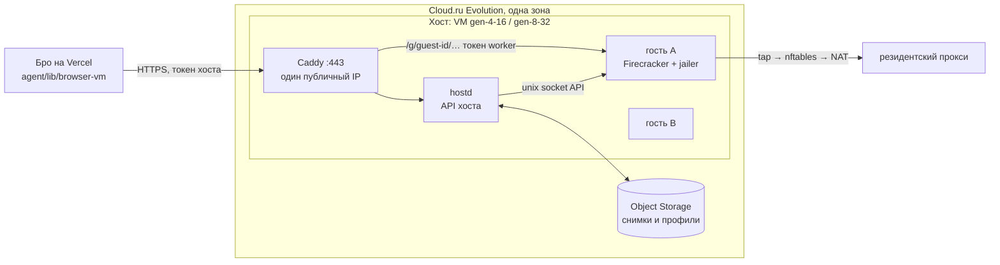

# Браузер в microVM со снимками: Firecracker на Cloud.ru

Дата: 29 сентября 2026 года. Статус: спецификация и план, код Бро не менялся.
Продолжение [`docs/browser-cloud-migration.md`](browser-cloud-migration.md):
там одна VM Cloud.ru на воркспейс, здесь — общие хосты, на которых браузер
каждого человека живёт в своей microVM Firecracker и между поручениями
хранится снимком в объектном хранилище. Замеры — стенд
[`scripts/cloudru-microvm-probe/`](../scripts/cloudru-microvm-probe/README.md).
Смежные рычаги экономии (проактивность, «без браузера», скрипты вместо модели) —
[`docs/agent-costs.md`](agent-costs.md).

## 1. Зачем: что не так со схемой «одна VM на человека»

Схема из раздела 13 плана переезда работает в пилоте, но растёт плохо. Цифры —
из раздела 12 плана и API Cloud.ru (цены с НДС):

- **Квота, а не деньги, упирает первой.** Остановленная VM держит vCPU и RAM
  квоты. По умолчанию у организации 8 vCPU и 2 публичных IP: на `gen-2-4` это
  4 человека, по IP — 2. Квоты поднимает только поддержка.
- **Постоянный платёж за каждого, даже спящего.** Диск SSD 10–12 ГБ — 114 ₽ в
  месяц, публичный IP — 149 ₽ (в посуточном расходе пилота подключённый IP не
  списывался, в тарифе он есть). При этом профиль Chrome весит 146–196 МБ.
- **Долгий старт.** Включение VM → первое действие: p50 80 с, p95 121 с;
  создание новой — p50 81 с, первая VM из свежего образа — около 6 минут.
- **Простой дорог по времени, а не по деньгам.** Минута работы VM стоит
  0,05 ₽, поэтому 20 минут простоя (`BROWSER_VM_IDLE_MINUTES`) держат, чтобы
  следующий шаг не ждал включения.
- **Страница, ждущая код, живёт, только пока живёт VM.** Выключение теряет
  открытую форму; вход приходится повторять.

Задача: платить за одновременные поручения, а не за число людей; стартовать
за секунды; «парковать» браузер вместе с открытой страницей.

## 2. Что проверено 29.09.2026

Стенд — обычная Ubuntu 22.04 на `gen-2-4` в `ru.AZ-3`, два независимых
прогона. Полная таблица и команды — README стенда. Главное:

| Вопрос                          | Ответ                                                                                      |
| ------------------------------- | ------------------------------------------------------------------------------------------ |
| KVM внутри VM Cloud.ru          | Есть: `vmx`, `/dev/kvm`, `nested=Y`. Процессор Ice Lake, хотя флейвор подписан Broadwell   |
| Firecracker внутри VM           | Работает; гость 256 МБ грузится до входа за 2,4 с                                          |
| Chrome в госте Firecracker      | Почти как без изоляции: Википедия 2,1–3,6 с против 1,9–2,5 с; example.com 0,45–0,73 с      |
| Chrome под gVisor (без KVM)     | Работает, но тяжёлая страница 5,8–7,0 с — в 3 раза медленнее; холодный старт 2,5–2,7 с     |
| Снимок уже запущенного Chrome   | Гость 1 ГБ в `/dev/shm` — 0,41 с; 2 ГБ на SSD VM — 30,6 с (диск ≈ 70 МБ/с)                 |
| Размер снимка                   | Память 1 ГБ с живым Chrome после `zstd -3` — 218 МБ за 1,9 с                               |
| Восстановление в новом процессе | 13–23 мс; тот же Chrome отвечает по CDP сразу, первая новая вкладка 140–440 мс             |
| Часы гостя после восстановления | Идут с момента паузы — подводить обязательно                                               |
| Внутренняя сеть между VM        | 218 МБ за 0,25 с (> 7 Гбит/с), задержка ≈ 3 мс                                             |
| VM без публичного IP            | В интернет не выходит; соседнюю VM по внутреннему адресу видит                             |
| Диск SSD 15 ГБ                  | Запись 65–73 МБ/с, случайное чтение ≈ 5 000 IOPS                                           |
| Object Storage (S3)             | Ключ принимается, но нужен `tenant_id` из консоли (`NoSuchTenant` без него) — не проверено |

Не проверено на стенде: наш образ (Chrome в Xvfb, worker, browser-use) внутри
гостя, размер его снимка, снимок во время работы агента, вложенная
виртуализация на других флейворах и в других зонах, прерываемые VM.

**Вложенная виртуализация в Evolution не задокументирована.** Для Advanced
Cloud.ru пишет, что её нет; официальные процессоры Evolution — Cascade Lake
(Gold 6248R) и Ice Lake (Gold 6348). Возможность может пропасть при переносе VM
на другой хост. До продакшена — письменное подтверждение поддержки (раздел 11).

## 3. Цены, на которые опирается расчёт

API `POST /api/v1/projects/{id}/price-calculation` (НДС включён) и тарифы
версии 260918:

| Ресурс                                   | Цена                                                     |
| ---------------------------------------- | -------------------------------------------------------- |
| `gen-2-4` (2 vCPU, 4 ГБ, 100% CPU)       | 2,97 ₽/ч, 2 139 ₽/мес                                    |
| `gen-2-8`                                | 5,50 ₽/ч, 3 962 ₽/мес                                    |
| `gen-4-16`                               | 7,98 ₽/ч, 5 745 ₽/мес                                    |
| `gen-8-32`                               | 15,96 ₽/ч, 11 489 ₽/мес                                  |
| `gen-16-64`                              | 31,92 ₽/ч, 22 979 ₽/мес                                  |
| `low-4-16` / `low-8-32` (30% CPU)        | 5,72 / 11,44 ₽/ч                                         |
| `lowcost10-2-4` / `lowcost10-4-16` (10%) | 0,99 / 2,66 ₽/ч                                          |
| SSD / HDD                                | 11,4 / 3,1 ₽ за 1 ГБ в месяц                             |
| Публичный IP / sNAT-шлюз                 | 149 ₽/мес каждый                                         |
| Object Storage Standard                  | 1,84 ₽ за ГБ в месяц; первые 15 ГБ организации бесплатно |
| Запросы S3 Standard                      | GET 0,027 ₽ / PUT 0,09 ₽ за тысячу                       |
| Трафик S3 внутри облака                  | бесплатно; наружу первые 10 ТБ в месяц бесплатно         |
| Bare Metal (2×E5-2699 v4, 64 ГБ)         | от 15 581 ₽/мес                                          |

Прерываемые VM есть (живут не дольше 24 часов, квота 4), цена в тарифе не
найдена. Container Apps (scale-to-zero) — 1,89 ₽ за vCPU·ч и 1,26 ₽ за ГБ·ч,
то есть 2 vCPU и 4 ГБ почти втрое дороже VM, а профиль там живёт только в
бакете: под браузер не берём.

## 4. Целевая схема

- **Хост** — обычная VM Cloud.ru с KVM (раздел 2) и образом хоста: Firecracker
  и `jailer` одной закреплённой версии, `hostd`, Caddy, nftables. Хост не
  хранит данных человека дольше, чем живёт его гость, и не держит их на диске
  в открытом виде.
- **Гость** — microVM на воркспейс: 2 vCPU, 2–4 ГБ (точнее — после замера
  нашего образа, раздел 10), корневой диск — общий образ только на чтение
  (нынешний `browser-vm/image`: Chrome в Xvfb, worker, browser-use),
  данные — свой диск-файл (профиль Chrome, файлы сессий, контрольные точки
  агента). Worker и его API не меняются: Бро говорит с ним как сейчас, только
  через Caddy хоста по пути `/g/<guest>/…` вместо `<ip>.sslip.io`.
- **`hostd`** — новый сервис хоста (Python, как worker; Firecracker API — HTTP
  по unix-сокету, как в `vm/snapshot_bench.sh`). Отвечает только за гостей:
  поднять, припарковать, удалить, отчитаться о ёмкости. Решений о людях не
  принимает.
- **Хранилище** — бакет Object Storage в той же зоне: набор снимка гостя и
  резервный архив профиля. Всё шифруется на хосте ключом воркспейса.
- **Бро** — вместо «создать или включить VM воркспейса» выбирает хост, просит
  `hostd` поднять гостя и помнит, где он. Контракт
  `agent/lib/browser-use/client.ts` и префикс `vm:` не меняются.

## 5. Жизненный цикл гостя

Состояния (новая колонка или таблица, раздел 9):

| Состояние   | Где данные                 | Что происходит                                                         |
| ----------- | -------------------------- | ---------------------------------------------------------------------- |
| `absent`    | нигде (новый воркспейс)    | первое поручение — холодный старт из образа с пустым профилем          |
| `booting`   | хост                       | загрузка гостя, старт Chrome и worker (оценка 10–15 с, замерить)       |
| `running`   | хост                       | поручение или ожидание человека                                        |
| `parking`   | хост → S3                  | пауза, снимок в `/dev/shm`, копия диска данных, сжатие, шифрование, S3 |
| `parked`    | S3                         | хост свободен; платим только за хранение (≈ 0,5–1 ₽ в месяц)           |
| `restoring` | S3 → хост                  | загрузка, распаковка, `snapshot/load`, подводка часов, проверка worker |
| `cold`      | S3, только архив профиля   | снимок несовместим или потерян: холодный старт с архивом профиля       |
| `failed`    | последний целый набор в S3 | алерт владельцу, как сейчас                                            |

**Парковка** (`hostd`, по просьбе Бро или по таймеру простоя):

1. Бро убеждается, что нет идущего запуска (`browser_vm_runs` и `GET /v1/runs`
   worker). Во время запуска не паркуем: снимок посреди отправки формы
   нельзя считать ни успехом, ни неуспехом (правило раздела 5 плана переезда).
2. Worker по `POST /v1/park` стирает из памяти ключи и секреты (ключ модели,
   логин прокси, `sensitive_data`) — после восстановления Бро присылает их
   заново, как после рестарта worker сейчас — и отвечает готовностью.
3. `PATCH /vm {"state":"Paused"}`, `PUT /snapshot/create` (Full) в
   `/dev/shm/<guest>/`; копия диска данных (`cp --sparse=always`) — гость на
   паузе, копия согласована.
4. Процесс Firecracker завершается, память хоста освобождается.
5. `zstd` и шифрование (AES-256-GCM потоком, ключ — HKDF от
   `BROWSER_STATE_KEY` и id воркспейса), загрузка в S3, запись манифеста
   последней (атомарно: без манифеста набор не существует).
6. Бро пишет `parked`, ключ набора и поколение.

Оценка по замерам: пауза и снимок 1 ГБ — 0,4 с, сжатие — около 2 с на ГБ,
загрузка внутри облака — секунды. Для гостя 3–4 ГБ парковка ≈ 10 с; ждать её
никто не должен — Бро отвечает человеку сразу.

**Восстановление:**

1. Бро выбирает хост (раздел 6) и зовёт `POST /v1/guests` с ключом набора.
2. `hostd` качает и расшифровывает набор, распаковывает память в
   `/dev/shm/<guest>/mem`, диск данных — на тот же путь, что был при снимке
   (путь и имя tap-устройства входят в снимок: `hostd` держит их стабильными,
   `/srv/guests/<guest>/data.img`, `tap-<guest>`).
3. `PUT /snapshot/load` с `resume_vm: true`.
4. Подводка часов: `hostd` передаёт время хоста worker'у (`POST /v1/clock`),
   тот вызывает `clock_settime` и перезапускает `chrony`, если он есть.
   Без этого TLS и сайты видят время паузы (замер: часы гостя продолжают с
   момента паузы).
5. Проверка worker (`/v1/health`), новые ключи (`POST /v1/session`) — как
   после рестарта worker сейчас. Открытые TCP-соединения гостя мертвы:
   форвардер прокси переподключается, Chrome перезапрашивает страницы сам.
6. Бро пишет `running` и хост.

Оценка: несколько секунд вместо нынешних 80. Замерить на нашем образе.

**Холодный путь** (`cold`) — когда снимка нет или он несовместим (другая
версия Firecracker, другой процессор хоста): гость грузится из образа с
сохранённым диском данных. Chrome пишет куки на диск примерно раз в 30 с, так
что последние секунды сессии могут потеряться; вход на сайтах, как правило,
переживает.

**Простой — по тому, кто разбудил** (идея из `agent-costs.md`): поручение из
расписания или хода-отчёта паркуется сразу после отчёта; поручение человека
держим живым 5–10 минут; ожидание кода — до срока ожидания, затем парковка
вместе с открытой страницей. Держать живым дорого только по памяти хоста, а
парковка стоит секунды — поэтому 20-минутный таймер не нужен.

**Один живой гость на воркспейс.** Набор снимка — это копия памяти: два
восстановления одного набора дадут два Chrome с одним профилем. Lease и
поколение из нынешнего `browser_vms` сохраняются: `hostd` принимает команды
только с текущим поколением, а новый набор пишется с поколением + 1.

## 6. Хосты и размещение

- **Выбор хоста** — в Бро: хост с свободной памятью (из `GET /v1/capacity`),
  предпочтительно тот, где набор уже лежит в `/dev/shm` (горячая парковка без
  S3, если хост не нужен под другое).
- **Размер гостя.** Нынешний образ на VM занимал p50 2,5 ГБ, p95 3,6 ГБ
  (Chrome, Xvfb, worker, browser-use). Если держать агент browser-use в
  госте — гость 4 ГБ; `gen-8-32` вмещает около 6 одновременных гостей
  (4 ГБ хосту и `/dev/shm`). Вынос агентного цикла из гостя на хост
  (гость — только Chrome, Xvfb и прокси-форвардер, агент говорит с CDP гостя)
  уменьшит гостя и снимок; решать по замеру (раздел 10, этап 1).
- **CPU.** Firecracker допускает переподписку vCPU: Chrome нагружает CPU
  рывками. Сколько гостей держит хост без потери скорости — замер этапа 3.
  Флейворы `low-*` и `lowcost10-*` (30% и 10% гарантированного CPU) для хоста
  проверить отдельно: под нагрузкой браузера они могут тормозить.
- **Хосты по требованию или постоянно.** Постоянный `gen-4-16` стоит 5 745 ₽ в
  месяц, `gen-8-32` — 11 489 ₽. Нынешняя схема стоит около 114–263 ₽ в месяц
  за человека плюс 2,97 ₽ за час работы. Поэтому:
  - пока людей с браузером меньше 20–50, хост включается по требованию
    (включение VM хоста ≈ 46 с — как сейчас одна VM, но одна на всех) и гаснет
    после простоя без живых гостей;
  - дальше — один постоянный хост и хосты по требованию на пиках;
  - прерываемые VM — кандидат на пиковые хосты (гость паркуется в S3, потеря
    хоста не теряет данные), когда станет известна цена.
- **Квота** считается по хостам: 8 vCPU — один `gen-8-32` или два `gen-4-16`
  вместо четырёх человек.

## 7. Сеть

- **Вход.** Один публичный IP на хост, Caddy с Let's Encrypt на своём домене
  (например `h1.browser.<домен>`; `sslip.io` уходит). Caddy проверяет токен
  хоста для `hostd` и пропускает `/g/<guest>/…` к worker гостя; токен worker
  остаётся прежним (HMAC от `BROWSER_VM_SIGNING_KEY`, `env` — id воркспейса).
- **Выход гостей.** tap на гостя, NAT хоста. nftables хоста: гость не видит
  других гостей, внутреннюю сеть `10.0.0.0/8`, metadata `169.254.169.254` и
  API `hostd`. Chrome и так ходит только через форвардер worker на
  резидентский прокси; прямой выход гостю нужен к прокси, RouterAI и S3 не
  нужен (S3 — у `hostd`).
- **Хосты без публичного IP** в интернет не выходят (раздел 2). Варианты —
  sNAT-шлюз (149 ₽/мес) или хост с IP как шлюз для остальных. **sNAT
  подключается ко всей зоне**, и документация не говорит, как с ним ведут себя
  VM, у которых уже есть свой IP. Создавать его только в зоне без продовых VM
  или после проверки на пробных VM.

## 8. Безопасность

- `jailer` на каждого гостя: свой uid/gid, chroot, seccomp, cgroup по памяти и
  CPU. Процесс Firecracker гостя не видит файлов других гостей.
- Снимок памяти содержит всё, что было в памяти гостя: куки, открытые
  страницы, данные форм. Поэтому шифрование на хосте до выгрузки, ключ только
  у Бро и `hostd` (не в S3), и стирание ключей и секретов worker перед
  парковкой (шаг 2). Удаление воркспейса удаляет его наборы и архивы в S3.
- Энтропия и уникальность: восстановленный гость наследует состояние ГПСЧ.
  Проверить поддержку VMGenID в выбранной версии Firecracker; если нет — worker
  после восстановления подмешивает энтропию от `hostd`.
- Данные остаются в России (Cloud.ru, `ru-central-1`), как требует раздел 9
  плана переезда.

## 9. Изменения в коде Бро (ориентир для реализации)

- `db/schema/browser-vms.ts`: к `browser_vms` добавить `guest_state`
  (`absent`, `booting`, `running`, `parking`, `parked`, `restoring`, `cold`,
  `failed`), `host_id`, `snapshot_key`, `snapshot_generation`,
  `snapshot_format` (версия Firecracker и шаблон CPU); новая таблица
  `browser_hosts` (id, VM Cloud.ru, адрес, состояние, ёмкость, `last_seen_at`).
  Миграцию генерировать поверх `bro-next` (dev-notes).
- `agent/lib/browser-vm/lifecycle.ts` — развилка по `BROWSER_BACKEND`:
  нынешняя «VM на воркспейс» остаётся как запасной путь, новая ветка —
  размещение гостя на хосте. Сторож (`reconcileBrowserVms` в тике
  `browser-runs`) следит и за хостами: включить, погасить пустой, вывести
  неотвечающий.
- `agent/lib/browser-vm/cloudru.ts` — только хосты (создать, включить,
  выключить); гости — новый клиент `agent/lib/browser-vm/host.ts` к `hostd`.
- `agent/lib/browser-vm/worker.ts` — базовый адрес гостя через хост.
- `browser-vm/host/` — `hostd`, образ хоста (`build.py` по образцу
  `browser-vm/image/build.py`), тесты на поддельном Firecracker API.
- `browser-vm/image/` — сборка образа гостя (ext4 только на чтение) из того же
  `provision.sh`, плюс `POST /v1/park` и `POST /v1/clock` в worker.
- Переменные окружения (через `shared/environment/env.ts`):
  `BROWSER_BACKEND=microvm`, `BROWSER_STATE_KEY`, `BROWSER_STATE_BUCKET`,
  `CLOUDRU_S3_TENANT_ID`, `BROWSER_HOST_FLAVOR`, `BROWSER_GUEST_MEMORY_MB`,
  `BROWSER_GUEST_IDLE_*`.

## 10. План по этапам и критерии готовности

**Этап 0 — от владельца (до кода).**

- Подключить Object Storage и дать `tenant_id` (консоль: «Хранение данных →
  Object Storage → Параметры работы с API»).
- Тикет в поддержку Cloud.ru: подтвердить вложенную виртуализацию на
  Evolution (флейворы, зоны, гарантия при миграции VM), поднять квоты vCPU и
  публичных IP, удалить VM, зависшую в `creating` (`bro-b6-b6c6-4d3db6` с
  28.09 держит 2 vCPU и публичный IP).

**Этап 1 — наш образ в госте (стенд, без Бро).** На пробной VM: гость из
нынешнего образа `browser-vm` (Chrome в Xvfb, worker, browser-use), снимок и
восстановление во время ожидания кода, поручение из бенчмарка до и после.
Готово, когда: известны память гостя (p50/p95), размер набора после сжатия,
время парковки и восстановления на 4 ГБ; worker отвечает после восстановления;
вкладка с формой ввода кода та же; вход на сайт (например WB) переживает
парковку; решено, где живёт агентный цикл (в госте или на хосте).

**Этап 2 — `hostd` и образ хоста.** API гостей, jailer, nftables, Caddy на
своём домене, шифрование и S3. Готово, когда: гость поднимается, паркуется в
S3 и восстанавливается на другом хосте; гость не видит соседа, metadata и
внутреннюю сеть (тест как `leak_check.py` пилота); удаление воркспейса чистит
S3; тесты `hostd` на поддельном Firecracker зелёные.

**Этап 3 — плотность и цена.** Несколько гостей на `gen-4-16` и `gen-8-32`
одновременно под поручениями бенчмарка. Готово, когда: известен предел гостей
на хост без роста медианы времени поручения больше чем на 20%; посчитана цена
поручения и месяца на человека при 10, 30 и 100 поручениях.

**Этап 4 — в Бро за флагом.** `BROWSER_BACKEND=microvm` и пилотный список
воркспейсов, как `BROWSER_VM_WORKSPACES`. Готово, когда: пилотный воркспейс
проходит RU-набор бенчмарка не хуже нынешней VM; p95 старта поручения из
`parked` меньше 15 с; сторож переживает падение хоста (гость поднимается из
последнего набора на другом хосте); ни одного поручения, запущенного дважды.

**Этап 5 — перевод и уборка.** Пилотные воркспейсы переезжают: VM воркспейса
останавливается, диск данных копируется в набор `cold`, VM удаляется. Нынешняя
ветка «VM на воркспейс» остаётся запасной, пока вложенная виртуализация не
подтверждена письменно.

## 11. Риски и запасные пути

| Риск                                                        | Что делаем                                                                                                                     |
| ----------------------------------------------------------- | ------------------------------------------------------------------------------------------------------------------------------ |
| Вложенную виртуализацию отключат или VM уедет на другой CPU | Подтверждение поддержки; запасные пути: Bare Metal (от 15,6 тыс. ₽/мес), нынешняя VM на воркспейс, gVisor (в 3 раза медленнее) |
| Снимок с Ice Lake не встаёт на Cascade Lake                 | Шаблон CPU Firecracker (`T2CL`/`T2S` или свой) у всех гостей; при несовместимости — `cold`                                     |
| Обновление Firecracker ломает старые снимки                 | Версия в `snapshot_format`; при смене версии — `cold` для всех наборов                                                         |
| Снимок сохранил секреты                                     | Стирание перед парковкой, шифрование, ключ вне S3                                                                              |
| Медленный диск хоста                                        | Снимки только в `/dev/shm`; на диск — лишь сжатые наборы                                                                       |
| sNAT затронет продовые VM                                   | Не создавать в зоне с продом без проверки на пробных VM                                                                        |
| Сайт выкинет сессию за время парковки                       | Как сейчас: `browser-sign-ins` продлевает входы; при парковке дольше суток — архив профиля                                     |

## 12. Открытые вопросы

- Как ведёт себя VM с собственным IP после создания sNAT в той же зоне.
- Цена прерываемых VM и доступность вложенной виртуализации на них.
- Работает ли S3 с нынешним ключом `CLOUDRU_KEY_ID` после подключения
  Object Storage (документация говорит «ключ действует для всех сервисов»).
- Нужен ли Xvfb в госте, или headless Chrome проходит те же сайты (снимок
  меньше, старт быстрее); антибот WB на headless отдал заглушку.
- Поведение Chrome после восстановления на сайтах с долгими соединениями
  (WebSocket, SSE): переподключается ли страница сама.
