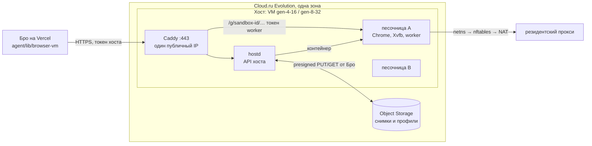

# Пул браузеров: песочницы gVisor со снимками на Cloud.ru

Дата: 30 сентября 2026 года. Статус на 30.09: этапы 1 и 2 пройдены, код
этапа 4 слит и проверен e2e на настоящих хостах; пул выключен.

- Этап 1 (раздел 2): заморозка gVisor работает (3,1 с, подъём на другой VM
  2,6 с), но медиана RU-набора под gVisor хуже на 44% — по правилу этапа пул
  строим на обычных контейнерах (`runc`) без заморозки памяти (раздел 11);
  gVisor — запасной вариант.
- Этап 2: код хоста — [`browser-vm/host/`](../browser-vm/host/README.md),
  `runc` по умолчанию, `runsc` со снимками — за настройкой `runtime`. Хост из
  стоковой Ubuntu через зеркала загружается до `ready` за ≈ 2 мин 13 с,
  парковка 0,74–0,85 с, набор ≈ 0,5 МБ.
- Этап 4: код Бро — `agent/lib/browser-pool/` за флагом;
  `pnpm test:e2e:browser-pool`: старт поручения из `parked` — p50 2,3 с, p95
  2,7 с за 12 циклов; сторож пережил сбой хоста, песочница поднялась на новом
  хосте с входами; дублей нет. Первое поручение без хоста (Бро создаёт VM)
  ждало 129 с, в другом прогоне — 381 с (причина не известна).
- Env пула в Vercel `bro-next` (prod и preview) задан 30.09 (раздел 9), но
  `BROWSER_POOL_WORKSPACES` нет — пул выключен. Включить пилот: задать
  `BROWSER_POOL_WORKSPACES` — id пилотного воркспейса или email владельца;
  действует со следующего деплоя.
- Осталось: пилот проходит RU-набор бенчмарка не хуже VM (нужны коды входа
  владельца), e2e на `gen-4-16`, этап 3 — плотность и цена (нужна квота).

Продолжение [`docs/browser-cloud-migration.md`](browser-cloud-migration.md):
там у каждого воркспейса своя VM Cloud.ru, здесь — общие VM-хосты, на которых
браузер каждого человека живёт в своей песочнице gVisor и между поручениями
хранится снимком в Object Storage. Замеры — стенд
[`scripts/cloudru-sandbox-probe/`](../scripts/cloudru-sandbox-probe/README.md).
Смежные рычаги экономии — [`docs/agent-costs.md`](agent-costs.md).

**Почему не Firecracker.** 29.09 на пробных VM Evolution нашлись `/dev/kvm` и
`nested=Y`, и Firecracker заработал. 30.09 поддержка Cloud.ru ответила:
вложенная виртуализация в Evolution не поддерживается ни на одном флейворе и
ни в одной зоне, использовать её нельзя ни в продакшене, ни в тестах. Поэтому
microVM на VM Evolution не строим. Firecracker остаётся запасным путём на
Bare Metal (раздел 11); VMware с вложенной виртуализацией Cloud.ru даёт только
юрлицам. gVisor работает без KVM и умеет то, ради чего нужны были microVM:
заморозить запущенный Chrome и поднять его в другой песочнице.

## 1. Зачем: что не так со схемой «одна VM на человека»

Цифры — раздел 12 плана переезда и API Cloud.ru (цены с НДС):

- **Квота упирает раньше денег.** Остановленная VM держит vCPU и RAM квоты.
  По умолчанию у организации 8 vCPU и 2 публичных IP: на `gen-2-4` это 4
  человека, по IP — 2.
- **Постоянный платёж за каждого, даже спящего.** Диск SSD 10–12 ГБ — 114 ₽ в
  месяц, публичный IP — 149 ₽. Профиль Chrome при этом весит 146–196 МБ.
- **Долгий старт.** Включение VM → первое действие: p50 80 с, p95 121 с;
  создание новой — p50 81 с, первая VM из свежего образа — около 6 минут.
- **Страница, ждущая код, живёт, только пока живёт VM.** Выключение теряет
  открытую форму; вход приходится повторять.

Задача: платить за одновременные поручения, а не за число людей; стартовать
за секунды; парковать браузер вместе с открытой страницей.

## 2. Что проверено

Пробные VM `gen-2-4` в `ru.AZ-3`, обычная Ubuntu 22.04. Команды и полные
таблицы — README стенда.

| Вопрос                                         | Ответ                                                                                   |
| ---------------------------------------------- | --------------------------------------------------------------------------------------- |
| Chrome без изоляции: example.com / Википедия   | 0,39–0,63 с / 1,9–2,5 с                                                                 |
| Chrome под gVisor (`systrap`): то же           | 2,5–2,7 с / 5,8–7,0 с — тяжёлая страница в 3 раза медленнее                             |
| **Заморозка gVisor с живым Chrome**            | `runsc checkpoint` — 0,76–0,89 с; образ 275–324 МБ, после `zstd -3` — 44–56 МБ за 0,7 с |
| **Восстановление в новой песочнице**           | `runsc restore` — 0,59 с; те же вкладки (ya.ru, example.com), CDP через 99 мс           |
| Сеть после восстановления                      | Новая вкладка открывает сайт через 159 мс: песочница в своём netns, NAT хоста           |
| Object Storage изнутри Cloud.ru, 200 МБ        | Загрузка одним потоком 7,8–9,2 с; скачивание — 5,2–5,6 с, в 4 потока по частям — 1,5 с  |
| Object Storage из-за границы (облачная сессия) | 50 МБ: загрузка 13,8 с, скачивание 3,4 с                                                |
| Внутренняя сеть между VM                       | 218 МБ за 0,25 с (> 7 Гбит/с), задержка ≈ 3 мс                                          |
| VM без публичного IP                           | В интернет не выходит; соседнюю VM по внутреннему адресу видит                          |
| Диск SSD 15–20 ГБ                              | Запись 65–73 МБ/с, случайное чтение ≈ 5 000 IOPS — снимки держать в `/dev/shm`          |
| KVM внутри VM Evolution                        | Технически есть, официально не поддерживается — не использовать                         |

**Этап 1 (30.09): наш образ в песочнице.** VM `gen-2-8` (2 vCPU, 8 ГБ,
Icelake), корень песочницы из `browser-vm/image/sandbox` (Chrome в Xvfb,
worker, browser-use), профиль — каталог хоста. Сравнение — тот же корень, сеть
и выход без gVisor: namespaces, `chroot`, оверлей на tmpfs. Выход сайтов —
прокси на самом хосте, то есть адрес Cloud.ru (резидентского прокси в сессии
не было). Модель — `deepseek/deepseek-v4.1-flash` через RouterAI.

| Вопрос                                                                    | Ответ                                                                                                                     |
| ------------------------------------------------------------------------- | ------------------------------------------------------------------------------------------------------------------------- |
| Старт песочницы до ответа worker с Chrome                                 | gVisor 1,5–1,9 с; без gVisor 0,4 с                                                                                        |
| RU-набор, 7 поручений: медиана / сумма / секунд на шаг                    | gVisor 104,6 / 808 / 14,1 с; без gVisor 72,8 / 789 / 12,0 с — **+44%** / +2% / +17%                                       |
| Медиана отношений времени по одинаковым поручениям                        | 0,99: разброс даёт число шагов модели (3 против 6, 13 против 6), не среда                                                 |
| Успех RU-набора                                                           | 6 из 7 в обоих; Госуслуги оба раза не нашли страницу услуги                                                               |
| Память песочницы в поручении, p50 / p95 (хост, за вычетом фона 0,6 ГБ)    | gVisor 1,5 / 2,2 ГБ; без gVisor 1,5 / 1,7 ГБ. Учёт самого gVisor — 2,0 / 2,7 ГБ, пик 3,0 ГБ                               |
| Заморозка с открытой формой входа: `runsc checkpoint`                     | 0,88 с, образ 326 МБ                                                                                                      |
| Набор: tar профиля (48 МБ) / zstd / AES-256-GCM / S3 в 3 части            | 0,05 / 0,69 / 0,13 / 1,34 с — всего ≈ 3 с, 83 МБ                                                                          |
| Восстановление на **другой** VM: S3 в 4 потока / расшифровка / распаковка | 1,0 / 0,09 / 0,62 с; `runsc restore` 0,73 с; worker отвечает через 0,19 с — всего ≈ 2,6 с                                 |
| Что пережило восстановление                                               | та же вкладка и введённое в поле значение, cookie и localStorage, часы (±0,03 с); новая вкладка открыла сайт за 3,8 с     |
| Восстановление в netns с другим адресом                                   | работает: gVisor берёт адрес нового netns, worker отвечает на нём, выход в сеть есть                                      |
| Холодный путь (только профиль): стоп Chrome / архив в S3 / обратно        | 0,5 / 1,8 с (37 МБ) / 1,2 с + старт 0,4 с; cookie и localStorage на месте, открытая страница — нет                        |
| Корень песочницы: каталог / в S3 после zstd / новый хост его поднимает    | 1,6 ГБ / 529 МБ / 17 с (скачивание 4,7 с)                                                                                 |
| WB и Avito с одного адреса Cloud.ru                                       | WB пускает в обоих; Avito — выдача в обоих поручениях. Стена «проблема с IP» — от частоты запросов с адреса, не от gVisor |

Не проверено: WB и Avito через резидентский прокси (в сессии нет логина
Geonode); восстановление на CPU другого поколения (все три пробные VM, и
`lowcost10`, — Icelake); вход на WB с настоящим аккаунтом (вместо него — метки
cookie и localStorage на странице входа Яндекса, форма не отправлялась);
WebSocket и SSE после восстановления; плотность на хосте (этап 3). Профиль
seccomp обычного контейнера с песочницей Chrome проверен позже — этап 4. Порядок и грабли — README
стенда.

**Этап 2 (30.09): `hostd` на настоящих VM.** Три хоста `gen-2-8` (2 vCPU,
8 ГБ, Icelake, `ru.AZ-3`) подняты так, как их поднимет Бро: стоковая
`ubuntu-22.04` и cloud-init из `boot.py` с presigned GET бандла и корня; ключ
подписи — случайный стенда, не продовый. Всё — через публичный HTTPS хоста
(`<ip>.sslip.io`, Let's Encrypt) из облачной сессии с токенами, как у Бро
(драйвер — `scripts/cloudru-sandbox-probe/pool.py`). Среда — `runc` 1.3.4
(Ubuntu), выход Chrome — прокси-заглушка на самом хосте (адрес Cloud.ru).

| Вопрос                                                          | Ответ                                                                                                                                                   |
| --------------------------------------------------------------- | ------------------------------------------------------------------------------------------------------------------------------------------------------- |
| Создание VM → `ready` в `/h/v1/health` по HTTPS                 | 133 и 132 с (VM `running` через 51 и 100 с); одна из трёх первых загрузок встала в `(initramfs)` — после `reboot` готова через 134 с                    |
| Установка хоста (`/srv/bro/timeline`, от старта скрипта)        | 62–67 с: apt с `mirror.yandex.ru` 33 с, venv 4 с, Caddy и `hostd` < 1 с, корень из S3 (529 МБ) 25–30 с                                                  |
| Старт песочницы (`hostd`) / до ответа worker с Chrome из сессии | 0,77–0,79 с / 2,5–2,9 с (ответ `POST` в сессии — 1,8–2,1 с); после перезагрузки хоста, с холодным кэшем, — 2,0 / 5,3 с                                  |
| Песочница Chrome                                                | работает без `--no-sandbox`: zygote в своих user- и pid-namespace, рендереры с seccomp-bpf (`Seccomp: 2`); seccomp контейнера нет                       |
| cgroup и корень                                                 | `memory.max` 3 ГБ, `pids.max` 4096, сразу после старта 230–650 МБ (со страничным кэшем); tmpfs и overlay смонтированы, после `DELETE` — ни одного следа |
| Короткое поручение (Рувики, `deepseek-v4.1-flash`)              | 60 с, 2 шага, ответ верный, 36 тыс. токенов — 0,88 ₽; `usage` токенами без `total_cost`, после `done` не висит                                          |
| Парковка: стоп Chrome / tar и zstd / S3 / всего                 | `systemctl` 0,13 с / 0,25–0,62 с / 1,1–1,2 с / 1,7–2,0 с; набор 40–70 МБ (профиль 54–103 МБ)                                                            |
| Подъём на **другом** хосте: S3 и распаковка / старт             | 1,2 с / 0,52 с (`path: cold`); из сессии — 2,7 с до ответа `hostd`, 3,3 с до Chrome; cookie и localStorage на месте (на том же хосте — 1,05 / 0,77 с)   |
| Перезапуск `hostd`                                              | песочница живёт, запись `running`                                                                                                                       |
| Перезагрузка хоста                                              | `hostd` и Caddy поднялись сами, песочница — `failed` с профилем; новая с тем же id и `DELETE` — работают                                                |
| Удаление воркспейса (`DELETE` и префикс набора в S3)            | на хосте нет монтирований, netns, veth, cgroup, каталогов, маршрута Caddy; в S3 — ничего                                                                |

Утечки — из песочницы A при соседке B на том же хосте (`vm/leak.py`, TCP):

| Куда                                                                                  | Итог                                                                                           |
| ------------------------------------------------------------------------------------- | ---------------------------------------------------------------------------------------------- |
| Соседка: её транзитный адрес (worker `:8080`, `:22`), её шлюз на хосте                | отказ сразу (TCP reset); **до правки — таймаут** (молча ронялось)                              |
| Хост: `hostd` `:8090`, Caddy `:80`/`:443`, ssh — по шлюзу песочницы и адресу в VPC    | отказ сразу; admin Caddy — только unix-сокет                                                   |
| VPC `10.0.0.0/8` (шлюз, соседи), `172.16/12`, `100.64/10`, metadata `169.254.169.254` | отказ сразу                                                                                    |
| Свой внутренний адрес `192.168.254.2` (он у всех один)                                | своя песочница — чужую так не достать                                                          |
| IPv6                                                                                  | нет адреса (`EADDRNOTAVAIL`), сразу                                                            |
| Публичный IP самого хоста                                                             | таймаут: Cloud.ru не разворачивает трафик на свой же плавающий IP; там только Caddy с токенами |
| Интернет (ya.ru, routerai.ru, raw.githubusercontent.com)                              | соединяется; GitHub днём 30.09 уже отвечал (200 за 0,5 с)                                      |

Найдено и исправлено на этапе 2 (ветка `claude/browser-pool-runc`):

- `build_rootfs.sh` в режиме ARCHIVE паковал корень с ещё смонтированными
  `/proc`, `/sys` и `/dev` сборки (tar шёл по живому `/proc` хоста):
  размонтирует до архива.
- Worker за Caddy хоста отдавал CDP-сокеты `wss://<хост>/v1/cdp/…` без
  префикса `/g/<песочница>/` — Caddy отвечал на них 404. Caddy передаёт
  префикс в `X-Forwarded-Prefix`, worker берёт только вид `/g/<id>`.
- Соседняя песочница молча ронялась (цепочка `forward` роняла трафик в `brt*`
  раньше отказа) — теперь `reject`.
- `oomScoreAdj` 500 контейнера — нижняя граница для всех процессов песочницы:
  Chrome не мог ставить рендерерам свои 300+ (EACCES на каждый) и не
  отличал их от процесса браузера. Теперь 200.
- Стенд: `console.py` сразу после входа отдавал эхо команды вместо вывода.

После ревью этапа 2 (30.09: тесты на поддельных командах и `runc` 1.3.4 в
облачной сессии; `hostd` 2026-09-30.4, worker 2026-09-30.2). На VM это
прогнано в этапе 4 (ниже): Chrome под `seccomp.json` со своей песочницей,
профиль на образе ext4, парковка SIGTERM init — работают.

- **seccomp.** Контейнер шёл без seccomp. Теперь `seccomp.json` рядом с
  `hostd` (по умолчанию, `seccomp_profile`): разрешено всё, кроме путей
  побега из контейнера — ключи ядра (`keyctl`, `add_key`, `request_key`),
  `bpf`, `userfaultfd`, `perf_event_open`, `mount` и новый API монтирования,
  `pivot_root`, `setns`, `io_uring`, модули, `kexec`, сокеты `AF_PACKET` и
  `NETLINK_NETFILTER`; только x86_64. Профиль Docker не взят: он запрещает
  user namespace, на котором стоит песочница Chrome. Проверено `runc` в
  сессии: запрещённое отвечает `EPERM`, `unshare` user-, pid- и
  net-namespace от `bro` работает, `mount` внутри нового userns — `EPERM`.
  Chrome под этим профилем на VM — этап 4 (ниже). AppArmor нет: профиля
  `docker-default` на хосте без Docker нет, а непроверенный свой — риск.
- **Парковка без `runc exec`.** `hostd` ничего не запускает внутри песочницы
  (`runc exec` в захваченный контейнер — вход известных побегов `runc`): SIGTERM
  init (`runc kill`), тот гасит worker, Chrome и Xvfb и выходит. `chromeStop`
  — `sigterm` или `killed` (init убил Chrome по `TimeoutStopSec` и написал это
  в `runtime.log`, или песочница не вышла за `chrome_stop_timeout_s` и её
  убили, или её уже не было): профиль мог отстать, но набор пишется, и
  песочница после SIGTERM в `running` не возвращается. На стенде этап 1 мерил
  этот путь в 0,5 с (этап 2 шёл через `systemctl` — 0,13 с).
- **Повтор на месте после сбоя загрузки** (тот же оверлей): init перед стартом
  снимает замок Xvfb `/tmp/.X99-lock` — в новом pid namespace pid из замка
  совпадал с pid нового Xvfb, и дисплей не поднимался никогда.
- **Профиль — свой образ ext4** (`profile_mb`, 2 ГБ, разреженный, `loop`,
  `nodev,nosuid`): песочница не забьёт диск хоста. CPU — `cpu.max` 2 vCPU
  (`cpus`). Ввода-вывода диска квоты нет.
- **Архивы.** В набор идут только обычные файлы и каталоги (второе имя
  жёсткой ссылки — копией); ссылки, FIFO и устройства не пакуются и не
  распаковываются, отказ фильтра `data` пропускает запись, а не валит набор
  (FIFO в профиле ломал каждое восстановление). У фильтра `data` были обходы
  через цепочки ссылок — без ссылок им не на что опереться.
- **Сеть.** Таблицу `inet bro` `hostd` ставит заново каждые 30 с
  (`rules_every_s`); у Caddy нет `CAP_NET_ADMIN` (только
  `CAP_NET_BIND_SERVICE`, `NoNewPrivileges`). Публичный IP хоста —
  в `egress_blocked` (`provision.sh`): отказ, а не таймаут. Порты `hostd`,
  ssh, 80, 443 и admin Caddy в `stand_host_ports` конфиг не пропустит.
- **Хост.** `kernel.unprivileged_userns_clone` — ручка ядра Debian, у Ubuntu
  её нет (22.04 user namespace и так разрешает, 24.04 понадобится
  `kernel.apparmor_restrict_unprivileged_userns = 0`): убрана. `bro` у всех
  песочниц — один uid хоста, лимиты ядра на uid общие: inotify поднят до 8192
  экземпляров. `runc` не старше 1.1.12 (CVE-2024-21626).
- **Состояние worker парковку `runc` не переживает**: запуски
  (`/var/lib/bro/runs`), сессии с памятью агента (`agentState`) и вкладки лежат
  в оверлее на tmpfs, в наборе — только профиль. Бро забирает итог запуска до
  парковки, а продолжение после подъёма начинает без памяти агента, как после
  перезапуска worker.
- **Колёса корня** ставятся только `pip install --require-hashes` по пинам
  PyPI, которые пишет `verify_wheels.py` в сессии; без них сборка не идёт.
- **Worker** выключает и проверку версии browser-use (`BROWSER_USE_VERSION_CHECK`:
  GET на PyPI с таймаутом 3 с на старте каждого запуска). Как и отказ от цены,
  нынешние VM получат это только с новым образом или через
  `POST /v1/admin/worker`.

Прогон этапа 2 стоил ≈ 5 ₽ VM (четыре VM, 53 минуты) и 0,88 ₽ RouterAI.

**Этап 4 (30.09): код Бро на настоящих хостах, без прода и веб-приложения.**
`tests/e2e/browser-pool.e2e.ts` (команда — раздел 10): `ensureBrowserVm`,
`reconcileBrowserVms` и `deleteBrowserVm` из `lifecycle.ts` с базой PGlite
в памяти ведут настоящие хосты Cloud.ru (`gen-2-8`, `ru.AZ-3`, префикс
`probe-host-`, `BROWSER_HOST_MAX=1`) и наборы в бакете. Ключи подписи и
наборов — случайные на прогон, прокси — заглушка (браузинга нет: метки
cookie ставит и читает CDP через Caddy хоста). Подменено только: алерты
владельцу собираются, а не шлются; в user data хоста — пароль root для
консоли стенда (осмотр песочницы). Парковка — окном простоя: сторож с часами
на 4 минуты вперёд (`BROWSER_VM_IDLE_MINUTES=3`). Три прогона; цифры —
второго и третьего (оба зелёные), бандл `host-d9b5f3673fb6`, корень
`sandbox-20260930.3`.

| Вопрос                                                         | Ответ                                                                                                                                                                                |
| -------------------------------------------------------------- | ------------------------------------------------------------------------------------------------------------------------------------------------------------------------------------ |
| Из `absent`: поручение ждёт хост (создание VM Бро → песочница) | 129 с (запись хоста: `creating` 23 с → `booting` 45 с → `ready` 131 с от начала прогона); в другом прогоне — 381 с (хронологии хоста тот прогон не писал: причина не известна)       |
| Старт поручения из `parked` до worker с Chrome, 12 циклов      | p50 2,3 с, p95 2,7 с (1,99–2,67 с): `ensureBrowserVm` 1,5–2,2 с (из них `hostd` 1,1–1,7 с, `path: cold`) + worker 0,45 с                                                             |
| Парковка (`hostd`, runc)                                       | 0,74–0,85 с: SIGTERM init 0,52 с (`chromeStop: sigterm`), tar 0,06–0,09 с, S3 0,06–0,15 с; набор 0,45–0,52 МБ (профиль 4,4 МБ); закрытие Chrome worker'ом — 2,1 с                    |
| Chrome в песочнице `runc`                                      | без `--no-sandbox`, `chrome://sandbox`: namespace, PID и сеть — да, Seccomp-BPF — да; init и все процессы — `Seccomp: 2` (`seccomp.json`); в `runtime.log` ошибок userns/seccomp нет |
| Профиль                                                        | `/dev/loopN ext4 rw,nosuid,nodev`; метка cookie пережила 6 парковок и подъём на новом хосте                                                                                          |
| CDP через Caddy (`/g/<id>/`)                                   | `captureViewportOverCdp` Бро и `Network.setCookie` по WebSocket — работают; адреса сокетов с префиксом                                                                               |
| Сторож: VM хоста удалена за спиной Бро                         | в первом же тике хост `failed` с алертом, песочница — назад к последнему набору (`parked`, 18 с); IP и запись хоста убраны через 35 с                                                |
| Подъём после падения                                           | новое поручение создало новый хост и подняло песочницу из набора за 125–139 с, метка на месте; поколение 8                                                                           |
| Дубли                                                          | после каждого шага — не больше одной живой песочницы воркспейса на хостах                                                                                                            |
| Удаление воркспейса                                            | песочница с хоста, `sets/<id>/` в S3 пуст, запись удалена; пустой хост сторож осушил и удалил вместе с IP                                                                            |

Найдено и исправлено на этапе 4:

- **SIGTERM не пишет свежие cookie.** Chrome считает SIGTERM концом сеанса
  (`exit_type: SessionEnded`) и выходит, не сохранив хранилище cookie:
  cookie последних 30 с (интервал записи Chrome) терялись с парковкой — на
  стенде cookie, поставленная прямо перед SIGTERM, на диск не попала, а после
  `Browser.close` — попала. Теперь Бро перед парковкой `runc`-хоста зовёт
  `POST /v1/park {"closeChrome": true}`: worker закрывает Chrome через CDP и
  ждёт, пока init поднимет новый (≈ 2 с); прогон подтвердил, что cookie за
  секунды до парковки переживает её. Старый worker флаг игнорирует.
- **Профиль рос на 4 МБ за парковку.** Каждый Chrome, остановленный SIGTERM,
  оставляет `BrowserMetrics/*.pma` по 4 МиБ и не забирает их: за 6 парковок
  профиль вырос с 4,3 до 25 МБ (образ профиля — 2 ГБ). `hostd` 2026-09-30.5 не
  кладёт `BrowserMetrics` в набор: профиль держится на 4,4 МБ.

Прогон этапа 4 стоил ≈ 5 ₽ VM (корень на `gen-2-4`, шесть хостов `gen-2-8`,
≈ 80 минут VM всего) и 0 ₽ RouterAI.

**Этап 4 в `ru.AZ-1` (30.09, после выключения `ru.AZ-3`).** Тот же e2e с
`CLOUDRU_ZONE=ru.AZ-1`, `CLOUDRU_SUBNET=Default_ru.AZ-1`,
`CLOUDRU_SECURITY_GROUP=bro-browser-az1`, `gen-2-8`, `probe-host-`, тот же
бандл и корень. Три прогона: первый упал на загрузке хоста (ниже), после
правки зелёные оба сценария — обычный цикл и `handover`.

| Вопрос                                              | Ответ                                                                                                                                                     |
| --------------------------------------------------- | --------------------------------------------------------------------------------------------------------------------------------------------------------- |
| Из `absent`: поручение ждёт хост                    | 352 с (цикл) и 336 с (`handover`); в AZ-3 — 129 с                                                                                                         |
| Запись хоста: `creating` → `booting` → `ready`      | 150 / 183 с, 166 / 165 с и 139 / 175 с: VM в AZ-1 становится `running` за 2,5–3 минуты (в AZ-3 — 23–45 с)                                                 |
| Сеть первой загрузки                                | DNS и выход появляются через ≈ 3 минуты после старта ОС: `bro-host-boot` ждал 5 попыток по 20 с (`Resolving timed out`), 6-я скачала бандл                |
| Установка хоста (`/srv/bro/timeline`)               | 51 с: apt с `mirror.yandex.ru` 18 с, venv 10 с, корень из S3 22 с — зеркало и S3 из AZ-1 доступны                                                         |
| Старт поручения из `parked` до worker, 6 циклов     | p50 2,0 с, p95 2,4 с (1,70–2,44 с): `hostd` 1,06–1,53 с (`path: cold`) + worker 0,45 с                                                                    |
| Парковка (`hostd`)                                  | 1,37–1,68 с; cookie, поставленная перед парковкой, пережила её                                                                                            |
| Chrome в песочнице `runc`                           | без `--no-sandbox`, `chrome://sandbox`: namespace, PID и сеть, Seccomp-BPF — да; процессы `seccomp=2`                                                     |
| Сторож: VM хоста удалена за спиной Бро              | хост `failed` с алертом, песочница `parked` за 18 с, запись и IP хоста убраны за 35 с; новый хост и подъём из набора — 347 с, метка на месте, поколение 8 |
| `handover`: запись с несуществующими id и именем VM | передана пулу, песочница на новом хосте (`path: fresh`, поколение профиля 2), алертов нет                                                                 |
| Удаление воркспейса                                 | `sets/<id>/` пуст, запись удалена, хосты с IP удалены — в обоих сценариях                                                                                 |

Найдено и исправлено: **хост в AZ-1 умирал на первой загрузке.** Cloud.ru
запускает VM, пока плавающий IP ещё подключается: первые ≈ 3 минуты нет ни
DNS, ни выхода. `bro-host-boot` делал 5 попыток скачать бандл за ≈ 150 с и
сдавался; cloud-init запускает его раз на инстанс, поэтому перезагрузка
молчащего хоста через 6 минут уже ничего не ставила, и хост упал бы через 15
минут, а новый не создавался бы ещё 30 (`createCooldownMs`). Теперь скрипт
ждёт сеть до 40 попыток через 10 с (7–13 минут,
`boot.py`/`hosts.ts`, тест `hosts.test.ts`); бандл не менялся — скрипт в user
data. Запас до перезагрузки молчащего хоста (6 минут от `booting`) — ≈ 2
минуты: хост отвечает через ≈ 4 минуты.

Прогон в AZ-1 стоил ≈ 3,5 ₽ VM (четыре хоста `gen-2-8`, ≈ 36 минут всего) и
0 ₽ RouterAI.

Артефакты (долговечные, в бакете стенда; не секреты). Прежние
(`sandbox-20260930.1`, `host-622fc3df2913`) и промежуточные этапа 4 удалены:

| Что                               | Ключ S3                                  | Размер                                   | SHA-256                                                            |
| --------------------------------- | ---------------------------------------- | ---------------------------------------- | ------------------------------------------------------------------ |
| Корень `sandbox-20260930.3`       | `pool/rootfs/sandbox-20260930.3.tar.zst` | 554 525 789 байт (каталог 1,6 ГБ)        | `604b9e820c8ffb889caedc9cb7c908268e5b16337bbcf5c29bf6930d822497b0` |
| Бандл хоста, `hostd` 2026-09-30.5 | `pool/host/host-d9b5f3673fb6.tgz`        | 22 862 341 байт (Caddy 2.10.2, 14 колёс) | `d9b5f3673fb68db5c3ea158b2bf5c91dd7d134639c4b98de9bc78eec5af5f43e` |

Корень собран на пробной VM `vm/rootfs_build.sh` (колёса — зеркало PyPI,
106 из 106 сверены с PyPI) с worker `2026-09-30.3` этой ветки, выгрузка
presigned PUT с VM — 23 с. Бандл — `boot.py bundle` из этой ветки.

## 3. Цены

API `POST /api/v1/projects/{id}/price-calculation` (НДС включён) и тарифы
версии 260918:

| Ресурс                                   | Цена                                                     |
| ---------------------------------------- | -------------------------------------------------------- |
| `gen-2-4` (2 vCPU, 4 ГБ, 100% CPU)       | 2,97 ₽/ч, 2 139 ₽/мес                                    |
| `gen-2-8`                                | 5,50 ₽/ч, 3 962 ₽/мес                                    |
| `gen-4-16`                               | 7,98 ₽/ч, 5 745 ₽/мес                                    |
| `gen-8-32`                               | 15,96 ₽/ч, 11 489 ₽/мес                                  |
| `gen-16-64`                              | 31,92 ₽/ч, 22 979 ₽/мес                                  |
| `low-4-16` / `low-8-32` (30% CPU)        | 5,72 / 11,44 ₽/ч                                         |
| `lowcost10-2-4` / `lowcost10-4-16` (10%) | 0,99 / 2,66 ₽/ч                                          |
| SSD / HDD                                | 11,4 / 3,1 ₽ за 1 ГБ в месяц                             |
| Публичный IP / sNAT-шлюз                 | 149 ₽/мес каждый                                         |
| Object Storage Standard                  | 1,84 ₽ за ГБ в месяц; первые 15 ГБ организации бесплатно |
| Запросы S3 Standard                      | GET 0,027 ₽ / PUT 0,09 ₽ за тысячу                       |
| Трафик S3 внутри облака                  | бесплатно; наружу первые 10 ТБ в месяц бесплатно         |
| Bare Metal (2×E5-2699 v4, 64 ГБ)         | от 15 581 ₽/мес                                          |

Снимок и профиль одного человека — порядка 100–250 МБ в S3, то есть меньше
0,5 ₽ в месяц. Container Apps (scale-to-zero) — почти втрое дороже VM за ту же
мощность, и профиль там живёт только в бакете: под браузер не берём.

## 4. Целевая схема



- **Хост** — обычная VM Evolution из стоковой `ubuntu-22.04`: своих образов в
  проекте не больше двух, и оба в проде, поэтому хост ставится при загрузке
  (cloud-init из `browser-vm/host/boot.py` запускает `provision.sh`: `runc`,
  nftables, zstd с `mirror.yandex.ru`, Caddy и колёса `hostd` — из бандла кода
  хоста в S3 с закреплёнными sha256; оценка — 2–3 минуты). GitHub, PyPI и
  `archive.ubuntu.com` с Cloud.ru молчат, поэтому хост ходит только на зеркало
  и в S3. Корень песочницы (каталог 1,6 ГБ, в S3 — 529 МБ) новый хост поднимает
  за 17 с. Данные человека живут на хосте, только пока живёт его песочница.
- **Песочница** — контейнер на воркспейс. Решение этапа 1: обычный контейнер
  (свои pid-, mount-, uts- и сетевой namespace, cgroup, seccomp-профиль запретов; OCI-bundle тот
  же, что у стенда, среда — `runc`), без gVisor и без снимка памяти. gVisor
  (`runsc`, `systrap`) с тем же bundle — запасной вариант со снимками, если
  повторный замер скорости это позволит (раздел 11). Корень — общий каталог из
  `browser-vm/image/sandbox/build_rootfs.sh` (тот же `provision.sh`, что у VM:
  Chrome в Xvfb, worker, browser-use, форвардер) под оверлеем в памяти; каталог
  хоста не меняется. Worker и его API не меняются: Бро говорит с ним как
  сейчас, только через Caddy хоста по пути `/g/<sandbox>/…` вместо
  `<ip>.sslip.io`; внутри песочницы worker слушает её интерфейс
  (`BRO_WORKER_BIND`).
- **Профиль** — отдельный каталог хоста, примонтированный в песочницу
  (`/srv/bro/sandboxes/<id>/profile`). Он — источник правды для входов на сайты
  и лежит в наборе отдельной частью (`profile`) рядом со снимком (`image`).
  Снимок памяти — быстрый путь: несовместим (другой `runsc`, флаги CPU, версия
  корня или меньше памяти), в `/dev/shm` нет места,
  `runsc restore` отказал или worker не ответил — песочница стартует заново с
  одним профилем (`cold`); набор только из профиля тоже бывает, а у обычного
  контейнера он единственный. Решение этапа 1: профиль — каталог хоста, не
  оверлей. Снимок gVisor с таким профилем встал на другой VM без жалоб
  (профиль распакован на тот же путь); в оверлее профиль жил бы в памяти
  песочницы и пропадал при холодном старте.
- **Цикл агента** — в песочнице, как сейчас: worker с browser-use рядом с
  Chrome. Без gVisor накладных расходов на него нет; вынос на хост менял бы
  контракт worker и держал бы ключ модели вне песочницы.
- **Экран** — Xvfb остаётся (≈ 190 МБ): headless пилот уже видел хуже на WB и
  Avito, а замеры этапа 1 повода менять не дали.
- **`hostd`** — сервис хоста (Python, как worker; `browser-vm/host/hostd.py`):
  создать песочницу, припарковать, восстановить, удалить, отчитаться о ёмкости.
  Решений о людях не принимает. Ключей S3 у хоста нет: Бро подписывает каждый
  PUT и GET набора (`<префикс>/<поколение>/chunk-NNNN`, `manifest.json`) и
  передаёт URL в запросе — ключ Cloud.ru на VM не попадает. Ключ данных набора
  (HKDF от `BROWSER_STATE_KEY` и id воркспейса) тоже приходит с запросом и живёт
  в памяти `hostd`.
- **Бро** — вместо «создать или включить VM воркспейса» выбирает хост, просит
  `hostd` поднять песочницу и помнит, где она. Контракт
  `agent/lib/browser-use/client.ts` и префикс `vm:` не меняются.

## 5. Жизненный цикл песочницы

| Состояние   | Где данные                 | Что происходит                                                     |
| ----------- | -------------------------- | ------------------------------------------------------------------ |
| `absent`    | нигде (новый воркспейс)    | первое поручение — старт из образа с пустым профилем               |
| `starting`  | хост                       | запуск песочницы, Chrome и worker (оценка — секунды, замерить)     |
| `running`   | хост                       | поручение или ожидание человека                                    |
| `parking`   | хост → S3                  | стоп Chrome, архив профиля, сжатие, шифрование, выгрузка           |
| `parked`    | S3                         | хост свободен; платим только за хранение                           |
| `restoring` | S3 → хост                  | скачивание, распаковка, старт песочницы, проверка worker           |
| `cold`      | S3, только архив профиля   | с gVisor: снимок несовместим или потерян — старт с архивом профиля |
| `failed`    | последний целый набор в S3 | алерт владельцу, как сейчас                                        |

**Парковка** (`hostd`, по просьбе Бро или по таймеру простоя):

1. Бро убеждается, что нет идущего запуска (`browser_vm_runs` и `GET /v1/runs`
   worker). Во время запуска не паркуем: снимок посреди отправки формы нельзя
   считать ни успехом, ни неуспехом.
2. Worker по `POST /v1/park` стирает из памяти ключи и секреты (ключ модели,
   логин прокси, `sensitive_data`); после восстановления Бро присылает их
   заново, как после рестарта worker сейчас.
3. Обычный контейнер: Chrome останавливается по SIGTERM (`systemctl stop
bro-chrome` worker, 0,5 с) — так cookie и localStorage попадают в профиль,
   затем песочница. С gVisor вместо этого `runsc checkpoint
--image-path=/dev/shm/bro-<id>` (0,9 с, образ ≈ 330 МБ); песочница при этом
   останавливается. В RAM — только сам снимок: tar и zstd — на диске
   (`/srv/bro/staging/<id>/`); нет места — 507 до заморозки.
4. Архив каталога профиля (`tar`; с gVisor — и образ), `zstd`, шифрование
   (AES-256-GCM, ключ — HKDF от `BROWSER_STATE_KEY` и id воркспейса), выгрузка
   в S3 частями параллельно, манифест последним (без манифеста набора нет). На
   стенде: 37 МБ за 1,8 с без памяти, 83 МБ за 3 с с образом.
5. Бро пишет `parked`, ключ набора и поколение.

**Восстановление:**

1. Бро выбирает хост и зовёт `POST /v1/sandboxes` с ключом набора.
2. `hostd` скачивает набор частями в 4 потока (40–80 МБ ≈ 1 с),
   расшифровывает, распаковывает профиль на тот же путь, снимок — в `/dev/shm`
   (промежуточные tar — на диске).
3. Сетевой namespace — новый перед каждым стартом и каждым `runsc restore`
   (`hostd` так и делает): `runsc` забирает адреса netns в свой netstack и
   снимает их с интерфейса, и песочница в уже бывшем в деле netns встаёт без
   сети. Адрес может отличаться от адреса при заморозке — проверено. Пути
   монтирований bundle — те же, что при заморозке; `root.readonly` — `false`
   (с `true` gVisor монтирует корень только на чтение и под `--overlay2`, init
   падает на `/run`), каталог корня хоста всё равно не меняется.
4. Старт контейнера (до ответа worker 0,4 с) или `runsc restore --detach`
   (0,7 с). Стандартные потоки песочницы — в файл, не в пайп: восстановленная
   песочница держит их открытыми, и чтение из пайпа ждёт вечно.
5. Проверка worker (`/v1/health`), новые ключи (`POST /v1/session`). Открытые
   TCP-соединения песочницы мертвы: форвардер прокси переподключается, Chrome
   перезапрашивает страницы сам.
6. Бро пишет `running` и хост.

По замерам: 1,6 с без памяти и 2,6 с со снимком вместо нынешних 80. Часы
после восстановления верные (±0,03 с): gVisor берёт время у ядра хоста.
Снимок хранит и то, что worker держал в памяти (логин прокси, ключ модели):
отсюда `POST /v1/park` перед заморозкой.

**Простой — по тому, кто разбудил** (идея из `agent-costs.md`): поручение из
расписания или хода-отчёта паркуется сразу после отчёта; поручение человека
держим живым 5–10 минут; ожидание кода — до срока ожидания. Без снимка
памяти открытая страница парковку не переживает: песочница, ждущая код,
живёт до срока ожидания (как VM сейчас), после него паркуется без страницы, и
вход начинается заново. Со снимком gVisor она паркуется вместе со страницей.

**Одна живая песочница на воркспейс.** Снимок — копия памяти: два
восстановления одного набора дадут два Chrome с одним профилем. Lease и
поколение из нынешнего `browser_vms` сохраняются: `hostd` принимает команды
только с текущим поколением, новый набор пишется с поколением + 1 (`hostd` не
восстанавливает набор, не старший поколения старта: иначе парковка перетёрла бы
его чанки).

## 6. Хосты и размещение

- **Выбор хоста** — в Бро: хост со свободной памятью (из `GET /v1/capacity`),
  лучше тот, где снимок ещё лежит в `/dev/shm`.
- **Размер песочницы.** Этап 1: в поручении p50 1,5 ГБ, p95 1,7 ГБ без gVisor
  и 2,2 ГБ с ним (пик учёта gVisor — 3,0 ГБ); простаивающая песочница с
  открытой страницей — ≈ 0,4 ГБ. Лимит cgroup — 3 ГБ на песочницу при любой
  среде.
- **CPU и флейвор.** Замеры этапа 1 — на 2 vCPU на песочницу, как у нынешней
  VM `gen-2-4`; скорость держит CPU, не память. Отсюда старт — `gen-4-16`:
  два одновременных поручения и ещё 2–3 песочницы, ждущих человека; больше
  двух одновременных — `gen-8-32` (4 поручения, память на ≈ 9 песочниц).
  Предел песочниц на хост без потери скорости — этап 3; `low-*` и
  `lowcost10-*` проверить отдельно: браузеру нужны рывки CPU.
- **Хосты по требованию или постоянно.** Постоянный `gen-4-16` — 5 745 ₽ в
  месяц, `gen-8-32` — 11 489 ₽; нынешняя схема — 114–263 ₽ в месяц на человека
  плюс 2,97 ₽ за час работы. Пока людей с браузером меньше 20–50, хост
  включается по требованию (≈ 46 с — как одна VM сейчас, но одна на всех) и
  гаснет, когда живых песочниц нет; дальше — постоянный хост и хосты на пиках.
  Прерываемые VM (живут до 24 часов) — кандидат на пиковые хосты: песочница
  паркуется в S3, потеря хоста не теряет данные.
- **Квота** считается по хостам: 8 vCPU — один `gen-8-32` или два `gen-4-16`
  вместо четырёх человек.

## 7. Сеть

- **Вход.** Один публичный IP на хост, Caddy с Let's Encrypt на настраиваемом
  домене (по умолчанию, как сейчас, `<ip>.sslip.io`). `/h/…` — к `hostd` на
  `127.0.0.1:8090`, он сам проверяет токен хоста (формат токена worker, ключ —
  HMAC от `BROWSER_VM_SIGNING_KEY` и `"bro-browser-host:" + id хоста`, приходит
  в cloud-init); `/g/<sandbox>/…` — без префикса к worker песочницы, токен
  worker прежний (`env` — id воркспейса); срезанный префикс Caddy передаёт
  worker в `X-Forwarded-Prefix`, и тот пишет его в адреса CDP-сокетов. Admin
  API Caddy — только unix-сокет: через него `hostd` перезагружает маршруты при
  создании и удалении песочниц.
- **Один адрес внутри у всех.** Снимок должен вставать на любом хосте, поэтому
  песочница всегда видит себя как `192.168.254.2/30` со шлюзом `.1` (вне VPC
  `10.0.0.0/8`), а уникальность — снаружи: у каждой песочницы свой netns
  роутера, между роутером и хостом — свой транзитный `/30` из `172.31.0.0/16`.
  Роутер делает SNAT выхода песочницы и DNAT `транзит:8080` → worker; Caddy
  ходит к worker по транзитному адресу. Схема живёт в одном модуле
  (`browser-vm/host/network.py`). Этап 1 показал, что восстановление смену
  адреса переносит (песочница живёт на адресе нового netns), а у обычного
  контейнера снимка нет вовсе: роутер на песочницу больше не нужен. Схема
  оставлена — работает и покрыта тестами; упрощение (уникальный адрес из пула
  хоста) — только в `network.py`. netns — новые на каждый старт.
- **Выход песочниц.** Таблица `inet bro` корневого netns собирается целиком и
  ставится атомарно (`nft -f`): песочница выходит только в интернет через uplink
  хоста с masquerade; другие песочницы, `10/8`, `172.16/12`, `192.168/16`,
  `100.64/10`, `169.254/16` (metadata), любые порты самого хоста (`hostd`,
  Caddy, ssh) и IPv6 закрыты; транзитный интерфейс пропускает только адрес
  своего роутера. Chrome по-прежнему ходит только через форвардер worker на
  резидентский прокси; напрямую песочнице нужны лишь DNS и API модели.
  Закрытое отвергается (tcp-reset, ICMP admin-prohibited), а не роняется
  молча: молчащий адрес держал поручение минутами (browser-use после `done`
  ходил за ценами моделей на GitHub и openrouter.ai — worker больше не ходит).
  Проверено на VM (раздел 2): всё закрытое, включая соседку, отказывает за
  < 1 мс; таймаут был только на публичный IP самого хоста (Cloud.ru не
  разворачивает трафик на свой плавающий IP) — теперь он в `egress_blocked`.
  gVisor не замораживает песочницу в сети хоста (`--network=host`): только
  свой netns.
- **Хосты без публичного IP** в интернет не выходят. Варианты — sNAT-шлюз
  (149 ₽/мес) или хост с IP как шлюз. sNAT подключается ко всей зоне, и
  документация не говорит, как с ним ведут себя VM со своим IP: создавать
  только в зоне без продовых VM или после проверки на пробных VM.

## 8. Безопасность

- Изоляция — namespaces, cgroup (память, CPU, процессы) и seccomp-профиль
  запретов `seccomp.json` обычного контейнера (с gVisor — ещё и своё ядро в
  пространстве пользователя), свой netns; без переназначения uid: root
  контейнера — root хоста, `bro` у всех песочниц — один uid хоста, AppArmor
  нет. Каталог корня
  хоста не меняется, запись — в оверлей в памяти. Песочница не видит файлов
  хоста, кроме своего каталога профиля и `worker.json`. Это слабее gVisor:
  ядро общее с хостом, поэтому на хосте — только песочницы Бро.
- Снимок содержит всё, что было в памяти: куки, открытые страницы, данные
  форм. Поэтому шифрование на хосте до выгрузки, ключ только у Бро и `hostd`
  (не в S3), стирание ключей и секретов worker перед парковкой. Удаление
  воркспейса удаляет его наборы и архивы в S3.
- Данные остаются в России (Cloud.ru, `ru-central-1`).

## 9. Изменения в коде Бро (ориентир для реализации)

- `db/schema/browser-vms.ts`: к `browser_vms` добавить `sandbox_state`
  (`absent`, `starting`, `running`, `parking`, `parked`, `restoring`, `cold`,
  `failed`), `host_id`, `snapshot_key`, `snapshot_generation`,
  `snapshot_format` (версия `runsc`); новая таблица `browser_hosts` (id, VM
  Cloud.ru, адрес, состояние, ёмкость, `last_seen_at`). Миграцию генерировать
  поверх `bro-next` (dev-notes).
- `agent/lib/browser-vm/lifecycle.ts` — развилка по `BROWSER_BACKEND`:
  нынешняя «VM на воркспейс» остаётся запасным путём, новая ветка — размещение
  песочницы на хосте. Сторож (`reconcileBrowserVms` в тике `browser-runs`)
  следит и за хостами: включить, погасить пустой, вывести неотвечающий.
- `agent/lib/browser-vm/cloudru.ts` — только хосты; песочницы — новый клиент
  `agent/lib/browser-vm/host.ts` к `hostd`.
- `agent/lib/browser-vm/worker.ts` — базовый адрес песочницы через хост.
- `agent/lib/browser-vm/host.ts` также подписывает S3: presigned PUT чанков
  (с запасом, занятое вернёт ответ парковки) и манифеста, presigned GET для
  восстановления — ключ S3 остаётся в Бро. Ключ данных набора —
  HKDF(`BROWSER_STATE_KEY`, id воркспейса), 64 hex в запросе; токен хоста — по
  образцу `signBrowserVmToken` с ключом `"bro-browser-host:" + id хоста` и без
  `gen` (поколение — в теле запросов `hostd`).
- Готово: `browser-vm/host/` — `hostd`, сеть, Caddy, наборы, `provision.sh` и
  cloud-init (`boot.py`: образа хоста нет, стоковая Ubuntu), тесты на поддельных
  `runc`, `runsc`, `mount`, `ip`, `nft` и S3 под обеими средами;
  `POST /v1/park` в worker. API `hostd` от среды не зависит: поля запросов те
  же, парковка `runc` отвечает без части `image` и с `format: null`,
  восстановление — `path: cold` (с gVisor — `restored`). Прогон на настоящих
  VM — раздел 2; корень и бандл хоста для этапа 4 лежат в S3 (там же).
- Worker (30.09): запуск больше не просит browser-use считать цену
  (`calculate_cost=False`): с ней browser-use после `done` тянул прайс LiteLLM с
  `raw.githubusercontent.com` и цены `openrouter.ai` — по 30 с на каждый вызов
  модели, оба молчат с Cloud.ru, и готовый запуск висел минутами. Токены
  browser-use считает и так; `total_cost` worker больше не отдаёт — рубли по
  токенам считает Бро (`shared/costs/prices.ts`). Нынешние VM получат это
  только с новым образом или через `POST /v1/admin/worker`.
- Готово в Бро (основа этапа 4, за флагом): переменные окружения и выбор
  (`usesBrowserPool` в `agent/lib/browser-vm/backend.ts`; воркспейс пула —
  тоже «VM»-воркспейс), колонки песочницы в `browser_vms` и таблица
  `browser_hosts`, `agent/lib/browser-pool/` — подпись S3 (SigV4), ключ данных
  и ключ хоста, клиент `hostd`, cloud-init, выбор, создание, осушение и
  удаление хостов.
- Готово в Бро (этап 4, за флагом): жизненный цикл песочницы —
  `agent/lib/browser-pool/sandbox.ts`, куда развилкой ведут `ensureBrowserVm`,
  `reconcileBrowserVms` и `deleteBrowserVm` из `lifecycle.ts`. Пул — другое
  размещение того же браузера: запись `browser_vms`, lease, id профиля
  `vm:<ws>:p<n>`, API и токены worker прежние; `state` VM зеркалит
  `sandbox_state` (`running` — `ready`, `starting`/`restoring` — `starting`,
  `parking` — `stopping`, остальное — `stopped`), поэтому запуски, очередь и
  окна простоя читают песочницу как VM. Адрес worker — `https://<ip>.sslip.io/g/<id>`
  (`worker.ts` по `host_id`); песочница без хоста в записи не зовётся вовсе:
  адрес удалённого хоста Cloud.ru мог отдать чужой VM.
  - Воркспейс пула без своей VM (`inBrowserPool`): VM, созданная раньше,
    остаётся его VM до переезда (этап 5). Запись, где VM ещё названа, но в
    Cloud.ru её нет ни по id, ни по имени, передаётся пулу
    (`handOverGoneVm` в `lifecycle.ts`, раздел 10, этап 5).
  - Подъём — под lease на 6 минут, прямо в поручении: хост из
    `placeBrowserSandbox`, запись хоста и `starting`/`restoring` — до вызова
    `hostd` (иначе пустой хост удалили бы под стартом), поколение + 1.
    `parked` — снимок, `cold` — только профиль, `absent` и `failed` — с нуля;
    забытые входы (`profile_reset_pending`) — наборы удаляются, старт с нуля.
    Набор отступает только при вине самого набора (не расшифровался, манифест
    не сходится, чанков нет, чужой воркспейс — `setFaultPattern`): снимок —
    `cold`, профиль — `failed` и алерт. Любой другой сбой (401, 5xx Caddy или
    `hostd`, runsc, сеть, истёкшие URL) — беда хоста: назад на тот же набор
    и алерт. Нет места (507), нет корня, старшее поколение на хосте или
    набор не старше старта (409) — назад, повтор; потерянный ответ —
    `starting` читает сторож, а поручение, заставшее переход без lease,
    дочитывает его само (`followForErrand`). Перед поручением Бро сверяет с
    Cloud.ru, что VM хоста жива на том же адресе.
  - Парковка — по окнам `idle.ts` (как выключение VM, те же проверки: нет
    открытого запуска, удерживаемой страницы, поручения в очереди, worker не
    занят), затем `POST /v1/park` worker (409 при запуске) и `hostd` park под
    поколением песочницы; набор пишется в запись, старшие наборы удаляются
    (`pruneSets`). Отказ `hostd` — сторож читает песочницу: живая —
    `running`, и следующая парковка ждёт 10 минут, дальше час
    (`park_failures`, `park_retry_at`), со всеми 4096 URL чанков; о третьем
    сбое подряд — алерт. `setWritten` (набор записан, песочница не удалилась)
    — набор берётся из манифеста. Без ключа и бакета наборов простаивающая
    песочница удаляется с хоста без парковки (алерт), чтобы хост опустел.
  - Сторож (тик `browser-runs`, при ключе Cloud.ru и ключе подписи — как
    сторож VM; без `browserPoolConfigured()` — только пока хосты остались):
    хосты (`reconcileBrowserHosts`) — хост без текущего корня осушается и
    удаляется пустым; пустой осушаемый хост поручение берёт обратно; хост,
    не поднявшийся при загрузке, держит слот ещё 30 минут после удаления VM
    (`create_blocked_until`), и новых хостов в это время нет; VM с именем
    слота, оставшаяся от потерянного создания, подхватывается; песочницы на хосте `failed`/`deleting` или без
    записи хоста — назад к последнему набору (`parked`, без набора —
    `absent`), следующее поручение восстановит на другом хосте; удаление
    `failed` хоста ждёт этого до 10 минут; зависшие `starting`/`restoring`/
    `parking` дольше 10 минут удаляются на хосте и возвращаются к набору;
    worker, пропустивший 3 проверки подряд без идущего запуска, — так же;
    песочницы на хосте, которых нет в записях, удаляются (`sweepBrowserHost`).
  - Удаление воркспейса: песочница на хосте, все объекты `sets/<id>/`, запись.
  - Учёт: `browser-vm` с ключом `browser-sandbox:…` — время на хосте по цене
    флейвора хоста × доля памяти песочницы (`docs/agent-costs.md`, 3.1).
  - Caddy хоста передаёт worker `X-Forwarded-Prefix: /g/<id>`: адреса CDP
    из `/json` worker строит с этим префиксом.
- Готово на этапе 1: `browser-vm/image/sandbox/` — сборка корня песочницы тем
  же `provision.sh` (`BRO_SANDBOX=1`) и `bro-sandbox-init` с заглушкой
  `systemctl`; `BRO_WORKER_BIND` в worker.
- Переменные окружения (через `shared/environment/env.ts`, все
  необязательны; без `BROWSER_POOL_WORKSPACES` и `BROWSER_BACKEND=pool` пул
  выключен и поведение прежнее):
  - `BROWSER_POOL_WORKSPACES` — пилотный список (id воркспейсов или email
    владельцев, как `BROWSER_VM_WORKSPACES`); `BROWSER_BACKEND=pool` — все.
  - `BROWSER_STATE_BUCKET`, `BROWSER_STATE_KEY` (hex, ≥ 32 байт; смена делает
    все наборы нечитаемыми), `CLOUDRU_S3_TENANT_ID`.
  - `BROWSER_HOST_BUNDLE` — `<ключ объекта>:<sha256>` бандла кода хоста
    (`boot.py bundle`, в том же бакете), например
    `pool/host/host-<sha256[:12]>.tgz:<sha256>`; `BROWSER_SANDBOX_ROOTFS` —
    `<версия>:<ключ объекта>:<sha256>` корня песочницы, например
    `sandbox-20260930.3:pool/rootfs/sandbox-20260930.3.tar.zst:604b9e82…` (полные
    хэши — таблица артефактов в разделе 2).
  - `BROWSER_HOST_RUNTIME` — `runc` (обычные контейнеры, набор — только
    профиль) или `runsc` (gVisor со снимками памяти); только при `runsc` нужен
    `BROWSER_HOST_RUNSC_RELEASE` — датированный выпуск gVisor. `runc` задаётся
    явно: без `BROWSER_HOST_RUNTIME` пул, как до этой настройки, — `runsc` с
    выпуском, а без выпуска выключен. Среду каждого хоста Бро берёт из его
    ёмкости (`runtime`), не из настройки: смена настройки старые хосты не
    трогает.
    Cloud-init пишет в `boot.json` среду, выпуск (`""` у `runc`) и зеркало apt
    (`http://mirror.yandex.ru/ubuntu`, как `APT_MIRROR` в `boot.py`); тест
    `tests/agent/browser-pool/hosts.test.ts` сверяет user data с выводом
    `python3 boot.py cloud-init` байт в байт под обеими средами.
  - `BROWSER_HOST_NAME_PREFIX` (`bro-host-`) — имена и id хостов
    `<префикс><слот>`; стенду или пробе — свой (`probe-host-`), чтобы ни имя
    VM, ни ключ токенов, ни запись с Бро не совпадали.
  - `BROWSER_HOST_FLAVOR` (`gen-4-16`), `BROWSER_HOST_MAX` (1),
    `BROWSER_HOST_IDLE_MINUTES` (60), `BROWSER_SANDBOX_MEMORY_MB` (3072).
  - Простой песочницы — прежние `BROWSER_VM_IDLE_*`.
  - Нужны и ключи VM-бэкенда: `BROWSER_VM_SIGNING_KEY`, `BROWSER_VM_PROXY`,
    `BROWSER_VM_LLM_API_KEY` (`browserPoolConfigured`).
  - User data хоста несёт его ключ токенов навсегда и presigned URL (час,
    с id ключа Cloud.ru и tenant): считайте её секретом хоста.
  - Ключ S3 — `<CLOUDRU_S3_TENANT_ID>:<CLOUDRU_KEY_ID>` и
    `CLOUDRU_KEY_SECRET`, эндпоинт `https://s3.cloud.ru`, регион
    `ru-central-1`: presigned PUT, GET, листинг и DELETE проверены на
    настоящем бакете 30.09.
- Бро под `runc` (после слияния с веткой хоста): `health` и `capacity`
  отдают `runtime` и `runtimeVersion` (Бро хранит `runtime` в ёмкости хоста);
  парковка `runc` отвечает `format: null` без части `image`, и запись хранит
  `snapshot_format` null; набор без снимка поднимается как `profile`, а не
  `restore` (иначе `hostd` каждый раз писал бы «снимок не поднялся»). URL
  чанков на парковку — по профилю (2 ГБ, 133 URL), под `runsc` — ещё и по
  памяти песочницы. Хост, чей `hostd` не ответил ни разу за 6 минут после
  `running` VM (первая загрузка встала в `(initramfs)`), Бро один раз
  перезагружает `set-power reboot` (`rebooted_at` в `browser_hosts`); дальше —
  прежний отказ через 15 минут. Не раньше: до `hostd` и Caddy идут apt и venv,
  медленное зеркало тоже молчит, а cloud-init запускает `bro-host-boot` раз на
  VM — перезагрузка посреди `provision.sh` его не возобновит (бюджет — 6 минут).
- Что нужно, чтобы включить пул (пока всё это не задано, пул выключен и
  поведение Бро прежнее):
  1. Сделано 30.09: бандл `host-d9b5f3673fb6` (`hostd` 2026-09-30.5) и
     корень `sandbox-20260930.3` (worker 2026-09-30.3) — в `pool/`, код Бро с
     ними прогнан на настоящих хостах (этап 4, раздел 2). Новый `hostd` или
     worker — новый бандл или корень и повтор `pnpm test:e2e:browser-pool`.
  2. Перед пилотом прогнать e2e ещё раз тем флейвором, что пойдёт в прод
     (`BROWSER_HOST_FLAVOR=gen-4-16`): квота — 4 vCPU и IP из пилотных.
  3. Сделано 30.09 в Vercel `bro-next` (prod и preview): `BROWSER_STATE_BUCKET`,
     `BROWSER_STATE_KEY`, `CLOUDRU_S3_TENANT_ID`, `BROWSER_HOST_BUNDLE`,
     `BROWSER_SANDBOX_ROOTFS`, `BROWSER_HOST_RUNTIME=runc` (ключи Cloud.ru и
     `BROWSER_VM_*` там уже есть). Осталось пилот —
     `BROWSER_POOL_WORKSPACES`; env действует со следующего деплоя.
  4. Квота: хост `gen-4-16` — 4 vCPU и публичный IP из тех же 8 vCPU и 2 IP,
     что у VM пилота.

## 10. План по этапам и критерии готовности

**Этап 0 — от владельца.** Сделано: Object Storage подключён, бакет есть,
`CLOUDRU_S3_TENANT_ID` заведён в окружении облачных сессий, поддержка ответила
про вложенную виртуализацию. Квоты решено не поднимать до этапа 3: этапам 1–2
хватает стандартных 8 vCPU и 2 публичных IP (пробная VM и VM пилота). Для
этапа 3 нужно ≈ 16 vCPU и 3–4 IP; первыми обычно кончаются IP. Зависшая в
`creating` VM удалена 30.09: она перешла в `running` и удалилась обычным
`DELETE`.

**Этап 1 — наш образ под gVisor (стенд, без Бро).** На пробной VM: песочница
из нынешнего образа `browser-vm`, профиль в отдельном каталоге, заморозка во
время ожидания кода и восстановление на **другой** VM. Готово, когда: известны
память песочницы (p50/p95), размер набора после сжатия, время парковки и
восстановления; worker отвечает после восстановления; вкладка с формой кода та
же; вход на WB переживает парковку; RU-набор бенчмарка под gVisor не дольше
нынешней VM больше чем на 30% по медиане; WB и Avito пускают Chrome под gVisor.
Если бенчмарк под gVisor заметно медленнее — пробуем обычные контейнеры
(namespaces и seccomp, без gVisor) без заморозки памяти: только архив профиля.

Итог 30.09 (раздел 2): всё, кроме резидентского выхода и CPU другого
поколения, проверено. Медиана RU-набора под gVisor — 104,6 с против 72,8 с без
него (+44%, сумма +2%, секунд на шаг +17%), правило сработало: дальше обычные
контейнеры, их замер — тот же прогон без gVisor.

**Этап 2 — `hostd` и загрузка хоста.** API песочниц, netns и nftables, Caddy
на своём домене, шифрование и S3. Готово, когда: песочница поднимается,
паркуется в S3 и восстанавливается на другом хосте; песочница не видит соседа,
metadata и внутреннюю сеть (тест как `leak_check.py` пилота); удаление
воркспейса чистит S3; тесты `hostd` зелёные. Сделано: код и тесты `hostd`
(`browser-vm/host/`), образа хоста нет — стоковая Ubuntu и cloud-init; `hostd`
переведён на обычный контейнер (`runc`, оверлей на tmpfs монтирует сам `hostd`,
парковка — мягкий стоп Chrome и архив профиля, восстановление — свежий старт с
профилем), gVisor со снимками — за `runtime: runsc`; выход песочниц —
`reject`, хост ставится без GitHub и PyPI. Прогон на настоящих VM 30.09
(раздел 2): загрузка до `ready` за ≈ 2 мин 13 с, песочница Chrome без
`--no-sandbox`, парковка и подъём на другом хосте с входами, утечки (всё
закрытое отказывает сразу), перезапуск `hostd` и хоста, удаление с уборкой S3 —
**этап 2 готов**. Четыре найденные ошибки исправлены (раздел 2); текущие
корень и бандл — таблица артефактов там же.

Осталось к этапу 4 (в Бро; код этапа 4 слит, за флагом — раздел 9):

- Пилот одному воркспейсу через веб-приложение и RU-набор бенчмарка на пуле
  (e2e этапа 4 гонит код Бро без прода, браузинга и поручений модели).
- Профиль Chrome в наборе — 54–103 МБ, из них ≈ 60 МБ моделей
  (`optimization_guide_model_store`) и Safe Browsing, кэши страниц: без них
  набор и парковка втрое меньше — решить, что выкидывать.
- `runsc` на настоящем хосте (`storage.googleapis.com` с Cloud.ru не
  проверен) — если вернёмся к gVisor.
- Сбой загрузки хоста вживую (перезагрузка молчащего хоста через 6 минут,
  отказ через 15): в e2e все загрузки прошли с первого раза.
- Бро не должен полагаться на состояние worker через парковку: итог запуска —
  до парковки, продолжение после подъёма — без памяти агента (раздел 2).
- Своё переназначение uid на песочницу (`uidMappings`): нужен корень с
  idmapped-монтированием (ядро 5.19+, у 22.04 — 5.15) или копия корня на слот.
- Корень с новым worker — пересборка `vm/rootfs_build.sh` (≈ 15 минут, 1 ₽;
  годится и пробный хост пула — у него уже есть зеркала) и новая версия в
  `BROWSER_SANDBOX_ROOTFS`; обновление worker без пересборки —
  `POST /v1/admin/worker`, как у VM.

**Этап 3 — плотность и цена.** Несколько песочниц на `gen-4-16` и `gen-8-32`
одновременно под поручениями бенчмарка. Готово, когда: известен предел
песочниц на хост без роста медианы времени поручения больше чем на 20%;
посчитана цена поручения и месяца на человека при 10, 30 и 100 поручениях.

**Этап 4 — в Бро за флагом.** `BROWSER_BACKEND=pool` и пилотный список
воркспейсов, как `BROWSER_VM_WORKSPACES`. Готово, когда: пилотный воркспейс
проходит RU-набор бенчмарка не хуже нынешней VM; p95 старта поручения из
`parked` меньше 15 с; сторож переживает падение хоста (песочница поднимается
из последнего набора на другом хосте); ни одного поручения, запущенного
дважды. Сделано: код (раздел 9) и тесты на подменённых `hostd`, worker и S3
(`tests/agent/browser-pool/sandbox.test.ts`: подъём из `absent`, `parked`,
`cold`, парковка только в простое и без запуска, падение хоста и подъём на
другом, поколения, удаление с уборкой S3, воркспейс вне списка — прежний
путь VM).

Прогон на настоящих хостах 30.09 (раздел 2) — e2e без прода и веб-приложения:

```sh
BROWSER_STATE_BUCKET=bucket-ac164a \
BROWSER_HOST_BUNDLE=pool/host/host-d9b5f3673fb6.tgz:d9b5f3673fb68db5c3ea158b2bf5c91dd7d134639c4b98de9bc78eec5af5f43e \
BROWSER_SANDBOX_ROOTFS=sandbox-20260930.3:pool/rootfs/sandbox-20260930.3.tar.zst:604b9e820c8ffb889caedc9cb7c908268e5b16337bbcf5c29bf6930d822497b0 \
BROWSER_VM_LLM_API_KEY=$ROUTERAI_API_KEY BROWSER_POOL_E2E_CONSOLE=1 \
pnpm test:e2e:browser-pool      # ≈ 8–13 минут, ≈ 1,5 ₽ VM; итоги — $BROWSER_POOL_E2E_RESULTS
```

Нужны ещё `CLOUDRU_KEY_ID`, `CLOUDRU_KEY_SECRET`, `CLOUDRU_S3_TENANT_ID`
(окружение облачной сессии). Ключи подписи и наборов прогон делает сам,
случайные; хосты — `probe-host-<n>` (`bro-…` запрещён), `BROWSER_HOST_MAX=1`:
один хост и один публичный IP за раз, новый создаётся после удаления
старого. Перед прогоном — `python scripts/cloudru-sandbox-probe/cloudru.py
usage`; уборка (хосты с IP, наборы) — в конце прогона, и при падении тоже.
`BROWSER_POOL_E2E_CONSOLE=1` дописывает пароль root в user data хоста (только
прогон) и смотрит песочницу с хоста консолью стенда. vitest показывает вывод
теста без TTY только при падении: ход прогона — в файле итогов.

Итог: **критерии p95 старта из `parked` (2,7 с < 15 с), падения хоста и
«без дублей» выполнены**; Caddy проксирует WebSocket CDP под `/g/<id>`, старт
из `absent` (создание хоста) — ≈ 2 минуты ожидания поручения в прогоне с
хронологией хоста; другой прогон ждал 381 с, и его причину (медленная загрузка
или `(initramfs)` с перезагрузкой) не записали.

**Пилот в проде (с 01.10).** `BROWSER_POOL_WORKSPACES` — воркспейс владельца,
хосты в `ru.AZ-1` (`gen-2-8`, `BROWSER_HOST_MAX=1`). Первое же поручение
передало исчезнувшую VM в пул (`[browser-pool] a gone VM was handed over` в
логах) и подняло `bro-host-1`. Браузерные кейсы RU-набора через `pnpm bench`
на brobro.tech, по одному, карточки оплаты и писем отклонены, ничего не
куплено; оценки — два независимых судьи по якорям (Opus и Sonnet):

| Кейс                      | Пул 01.10: время, оценки                                                              | Своя VM 29.09                                        |
| ------------------------- | ------------------------------------------------------------------------------------- | ---------------------------------------------------- |
| d01 «Сапсан»              | 20 мин вместе с созданием хоста; rzd.ru, цены с сайта, вход только по паролю; 4,5 и 4 | ≈ 17 мин + создание VM ≈ 8 мин; rzd.ru, цены с сайта |
| d02 авиабилеты            | 11 мин с тёплой песочницы, варианты с багажом в бюджете с первого запуска; 4 и 4,5    | ≈ 31 мин: первый запуск перепутал направление        |
| uc-sh-compare             | 9,5 мин: ВБ и Маркет по 3 модели со ссылками, Ozon честно «не открылся»; 5,5 и 7      | —                                                    |
| uc-sh-avito-buy           | 17 мин: 3 объявления со ссылками и разбором продавцов; 7 и 7                          | 5 мин до выдачи, объявления — стена Geetest, 0       |
| d03 подбор (без браузера) | 6,5 и 7                                                                               | —                                                    |

Среднее двух судей — 5,7. Последняя оценка до пула — финал 25.09 (Browser
Use Cloud, другие судьи): d01 6,5, d02 3, d03 5,5. d01 ниже: rzd.ru пустил
только по паролю, а 60 шагов кончились до вечерних обратных рейсов и tutu;
это не пул: worker и бюджет шагов те же, что на VM. По VM 29.09 пул не хуже:
те же сайты открылись, d02 и Avito лучше. Старт поручения с тёплой песочницы —
≈ 2 с, с холодного хоста в AZ-1 — до 6 минут (VM доходит до `running`
2,5–3 минуты). Модель браузера (RouterAI) — ≈ 18 ₽ за поручение, основной
агент — 10,5 ₽ на 5 кейсов. Через 20 минут простоя песочница пилота ушла в
набор (поколение 3): ≈ 255 МиБ, 16 частей по 16 МиБ, против ≈ 0,5 МБ в e2e.
`pack` (`browser-vm/host/hostd.py`) кладёт в набор весь профиль Chrome вместе с
кэшами (`Cache`, `Code Cache`, `GPUCache`…). Исключение кэшей сократит
парковку, подъём и трафик S3, но для выката нужен новый `BROWSER_HOST_BUNDLE`.
Осталось: кэши вне набора, перенос профилей VM в S3 (этап 5) и этап 3
(квота).

**Этап 5 — перевод и уборка.** Пилотные воркспейсы переезжают: профиль с диска
VM — в архив S3, VM удаляется. Ветка «VM на воркспейс» остаётся запасной.

Сделано: передача исчезнувшей VM. Воркспейс из списка пула, чья запись ещё
называет свою VM (`vm_id`, или `failed` с одним `vm_name`), при поручении в
`stopped`/`failed` проверяется в Cloud.ru — по id, а записи без id — по
имени. VM жива — прежний путь VM (включение; запись без id сначала берёт id
найденной по имени VM: это её же VM, чей ответ на создание потерялся), её не
трогаем, а ошибка включения доходит до поручения, как у любой VM. Нет VM —
сначала локальные проверки (открытый запуск за час, удерживаемая страница;
есть — ждём 45 с, и каждая попытка стоит Cloud.ru одного запроса), потом
поиск по имени. Нет и по имени — под lease запись забывает VM: адрес и бэкапы
диска освобождаются, `vm_id`, `vm_name`, `host`, `floating_ip_id`,
`boot_disk_id`, `image`, выход прокси и отметки worker стираются, `state` —
`stopped`, открытый отрезок времени VM пишется в `usage_costs` (не записался —
ещё одна попытка, как у `closeRemovedUptime`, потом отпускается с логом:
иначе он лёг бы на песочницу), строка
`[browser-pool] a gone VM was handed over to the pool`, и то же поручение идёт
в пул — свежая песочница. Поколение профиля растёт, как у `forgetGoneVm`, — это
решение, а не недосмотр: профиль ушёл с диском, и входы, записанные на
старый, должны читаться забытыми; липкая сессия прокси остаётся. Ошибка
Cloud.ru (5xx, таймаут) — ничего не передаём, ждём минуту. VM с тем же
именем, но другим id — владельцу алерт `browser-pool-handover:<ws>` (не чаще
раза в 6 часов), поручения ждут. Воркспейсу пула VM больше не создаётся ни
при каком состоянии записи. Сторож (`reconcileBrowserVms`) для таких же
записей (`failed`, `starting`, `stopping`, `stopped` с забытыми входами)
делает ту же передачу вместо `forgetGoneVm` после проверки по имени и ничего
не включает; открытые запуски он не ждёт — у исчезнувшей VM они уже мертвы.
Имя находит VM — запись остаётся как есть и владелец получает тот же алерт
(иначе запись в `starting` висела бы молча); вне списка пула — прежнее
поведение, без новых запросов.
Тесты — `tests/agent/browser-pool/sandbox.test.ts` («handing a pool
workspace's gone VM over»); e2e — `BROWSER_POOL_E2E_SCENARIO=handover pnpm
test:e2e:browser-pool` (запись с несуществующими id и именем, хост `probe-host-`,
остальное окружение — как у прогона выше).

Прогон e2e 30.09 (`handover`, `gen-2-8`, `probe-host-`): запись с
несуществующими id и именем передана пулу по настоящим ответам Cloud.ru (404
по id, пустой список по имени), строка `[browser-pool]` в логе; хост не
создался — Cloud.ru ответил 422 `wrong_az_by_name`: зона `ru.AZ-3`
выключена (docs/browser-infra-notes.md). Песочница на хосте в этом прогоне не
поднималась; VM не создано, трат нет, наборов нет. Прогон заодно показал, что
e2e без `BROWSER_HOST_RUNTIME` в окружении сессии остаётся без пула (с
выпуском `runsc` — только gVisor): теперь он ставит `runc` сам.

Пул переезжает в `ru.AZ-1` (docs/browser-infra-notes.md): подсеть
`Default_ru.AZ-1` (`10.0.1.0/24`) и группа `bro-browser-az1` с правилами
`bro-browser`; прод — `CLOUDRU_ZONE=ru.AZ-1`, `CLOUDRU_SUBNET=Default_ru.AZ-1`,
`CLOUDRU_SECURITY_GROUP=bro-browser-az1`. Хосты читают зону, подсеть и группу
только из этих env (`createVm` в `agent/lib/browser-vm/cloudru.ts`), зашитых
значений нет. Подсеть и группа в AZ-1 заведены 30.09, e2e в AZ-1 прогнан
(раздел 2): **зелёные оба сценария** — обычный цикл (из `absent` 352 с,
старт из `parked` p50 2,0 с, p95 2,4 с, сторож и подъём на новом хосте,
удаление) и `handover` (песочница после передачи на настоящем хосте за
336 с). `mirror.yandex.ru` и S3 из AZ-1 доступны. Хост в AZ-1 создаётся
дольше (VM `running` через 2,5–3 минуты, сеть — ещё позже): загрузка хоста
теперь ждёт сеть до 13 минут.

Осталось: перенос профиля с **живой** VM в набор S3 (архив профиля с диска
VM, запись `cold`, удаление VM) — пока такая VM остаётся VM воркспейса.

## 11. Риски и запасные пути

| Риск                                             | Что делаем                                                                                                   |
| ------------------------------------------------ | ------------------------------------------------------------------------------------------------------------ |
| gVisor замедляет поручения сильнее допустимого   | Сработало на этапе 1 (медиана +44%): обычные контейнеры без заморозки памяти, только архив профиля           |
| Антибот сайтов отличает Chrome под gVisor        | Этап 1 на WB и Avito; при отказе — обычные контейнеры для этих сайтов                                        |
| Снимок не встаёт на хосте с другим CPU           | Не проверено: все пробные VM — Icelake. При несовместимости — `cold` (архив профиля)                         |
| Обновление `runsc` ломает старые снимки          | Версия пакета в `snapshot_format` (с `/usr/bin/gvisor-bin/*`); при смене — `cold` для всех наборов           |
| Снимок сохранил секреты                          | Стирание перед парковкой, шифрование, ключ вне S3                                                            |
| Медленный диск хоста                             | Снимки только в `/dev/shm`; на диск — лишь tar и сжатые части набора                                         |
| sNAT затронет продовые VM                        | Не создавать в зоне с продом без проверки на пробных VM                                                      |
| Нужны снимки как у microVM, а gVisor не подходит | Bare Metal (от 15,6 тыс. ₽/мес, свой KVM) и Firecracker по прежнему плану — окупается от ≈ 60 активных людей |

## 12. Открытые вопросы

Решено на этапе 1: снимок gVisor встаёт на другой VM того же флейвора и в
netns с другим адресом; профиль — в каталоге хоста; цикл агента — в песочнице;
Xvfb остаётся; среда — обычные контейнеры (раздел 11). На этапе 4: Chrome
под `seccomp.json` работает со своей песочницей (namespace и seccomp-bpf).

- Пускают ли WB и Avito через резидентский прокси — нужен логин Geonode в
  окружении облачных сессий. С адреса Cloud.ru gVisor вердикт не менял.
- Стоит ли вернуть gVisor: по сумме и медиане парных отношений разницы нет,
  по медиане набора +44%, по времени шага +17%. Решит повтор набора по 3 раза
  на среду (≈ 135 ₽ RouterAI).
- Встаёт ли снимок на CPU другого поколения.
- Выход с Cloud.ru: 30.09 утром GitHub, PyPI, openrouter.ai, Википедия и часть
  зарубежных сайтов принимали соединение и молчали, днём
  `raw.githubusercontent.com` уже отвечал за 0,5 с. Хост пула от них не зависит
  (зеркало apt и бандл в S3); образ VM (`build.py`) ставит uv и jev с GitHub —
  корень песочницы стенд собрал через зеркала (`BRO_PYTHON_SETUP`).
- Как ведёт себя VM с собственным IP после создания sNAT в той же зоне.
- Цена прерываемых VM.
- Поведение страниц с долгими соединениями (WebSocket, SSE) после
  восстановления.
