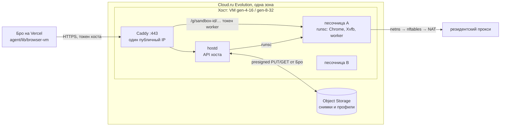

# Пул браузеров: песочницы gVisor со снимками на Cloud.ru

Дата: 30 сентября 2026 года. Статус: код хоста (этап 2) —
[`browser-vm/host/`](../browser-vm/host/README.md), проверен на поддельном
`runsc`, без настоящих VM; код Бро (этап 4) — `agent/lib/browser-pool/`, за
флагом и выключен: проверен тестами на PGlite и подменённых `hostd` и S3, на
настоящих хостах не запускался (раздел 10).
Продолжение [`docs/browser-cloud-migration.md`](browser-cloud-migration.md):
там у каждого воркспейса своя VM Cloud.ru, здесь — общие VM-хосты, на которых
браузер каждого человека живёт в своей песочнице gVisor и между поручениями
хранится снимком в Object Storage. Замеры — стенд
[`scripts/cloudru-sandbox-probe/`](../scripts/cloudru-sandbox-probe/README.md).
Смежные рычаги экономии — [`docs/agent-costs.md`](agent-costs.md).

**Почему не Firecracker.** 29.09 на пробных VM Evolution нашлись `/dev/kvm` и
`nested=Y`, и Firecracker заработал. 30.09 поддержка Cloud.ru ответила:
вложенная виртуализация в Evolution не поддерживается ни на одном флейворе и
ни в одной зоне, использовать её нельзя ни в продакшене, ни в тестах. Поэтому
microVM на VM Evolution не строим. Firecracker остаётся запасным путём на
Bare Metal (раздел 11); VMware с вложенной виртуализацией Cloud.ru даёт только
юрлицам. gVisor работает без KVM и умеет то, ради чего нужны были microVM:
заморозить запущенный Chrome и поднять его в другой песочнице.

## 1. Зачем: что не так со схемой «одна VM на человека»

Цифры — раздел 12 плана переезда и API Cloud.ru (цены с НДС):

- **Квота упирает раньше денег.** Остановленная VM держит vCPU и RAM квоты.
  По умолчанию у организации 8 vCPU и 2 публичных IP: на `gen-2-4` это 4
  человека, по IP — 2.
- **Постоянный платёж за каждого, даже спящего.** Диск SSD 10–12 ГБ — 114 ₽ в
  месяц, публичный IP — 149 ₽. Профиль Chrome при этом весит 146–196 МБ.
- **Долгий старт.** Включение VM → первое действие: p50 80 с, p95 121 с;
  создание новой — p50 81 с, первая VM из свежего образа — около 6 минут.
- **Страница, ждущая код, живёт, только пока живёт VM.** Выключение теряет
  открытую форму; вход приходится повторять.

Задача: платить за одновременные поручения, а не за число людей; стартовать
за секунды; парковать браузер вместе с открытой страницей.

## 2. Что проверено

Пробные VM `gen-2-4` в `ru.AZ-3`, обычная Ubuntu 22.04. Команды и полные
таблицы — README стенда.

| Вопрос                                         | Ответ                                                                                   |
| ---------------------------------------------- | --------------------------------------------------------------------------------------- |
| Chrome без изоляции: example.com / Википедия   | 0,39–0,63 с / 1,9–2,5 с                                                                 |
| Chrome под gVisor (`systrap`): то же           | 2,5–2,7 с / 5,8–7,0 с — тяжёлая страница в 3 раза медленнее                             |
| **Заморозка gVisor с живым Chrome**            | `runsc checkpoint` — 0,76–0,89 с; образ 275–324 МБ, после `zstd -3` — 44–56 МБ за 0,7 с |
| **Восстановление в новой песочнице**           | `runsc restore` — 0,59 с; те же вкладки (ya.ru, example.com), CDP через 99 мс           |
| Сеть после восстановления                      | Новая вкладка открывает сайт через 159 мс: песочница в своём netns, NAT хоста           |
| Object Storage изнутри Cloud.ru, 200 МБ        | Загрузка одним потоком 7,8–9,2 с; скачивание — 5,2–5,6 с, в 4 потока по частям — 1,5 с  |
| Object Storage из-за границы (облачная сессия) | 50 МБ: загрузка 13,8 с, скачивание 3,4 с                                                |
| Внутренняя сеть между VM                       | 218 МБ за 0,25 с (> 7 Гбит/с), задержка ≈ 3 мс                                          |
| VM без публичного IP                           | В интернет не выходит; соседнюю VM по внутреннему адресу видит                          |
| Диск SSD 15–20 ГБ                              | Запись 65–73 МБ/с, случайное чтение ≈ 5 000 IOPS — снимки держать в `/dev/shm`          |
| KVM внутри VM Evolution                        | Технически есть, официально не поддерживается — не использовать                         |

Не проверено: наш образ (Chrome в Xvfb, worker, browser-use) под gVisor;
память такой песочницы; заморозка во время ожидания кода с живым входом на
сайт; восстановление на другой VM; как антибот WB и Avito относятся к Chrome
под gVisor; скорость поручения из бенчмарка целиком (не только загрузка
страницы) под gVisor.

## 3. Цены

API `POST /api/v1/projects/{id}/price-calculation` (НДС включён) и тарифы
версии 260918:

| Ресурс                                   | Цена                                                     |
| ---------------------------------------- | -------------------------------------------------------- |
| `gen-2-4` (2 vCPU, 4 ГБ, 100% CPU)       | 2,97 ₽/ч, 2 139 ₽/мес                                    |
| `gen-2-8`                                | 5,50 ₽/ч, 3 962 ₽/мес                                    |
| `gen-4-16`                               | 7,98 ₽/ч, 5 745 ₽/мес                                    |
| `gen-8-32`                               | 15,96 ₽/ч, 11 489 ₽/мес                                  |
| `gen-16-64`                              | 31,92 ₽/ч, 22 979 ₽/мес                                  |
| `low-4-16` / `low-8-32` (30% CPU)        | 5,72 / 11,44 ₽/ч                                         |
| `lowcost10-2-4` / `lowcost10-4-16` (10%) | 0,99 / 2,66 ₽/ч                                          |
| SSD / HDD                                | 11,4 / 3,1 ₽ за 1 ГБ в месяц                             |
| Публичный IP / sNAT-шлюз                 | 149 ₽/мес каждый                                         |
| Object Storage Standard                  | 1,84 ₽ за ГБ в месяц; первые 15 ГБ организации бесплатно |
| Запросы S3 Standard                      | GET 0,027 ₽ / PUT 0,09 ₽ за тысячу                       |
| Трафик S3 внутри облака                  | бесплатно; наружу первые 10 ТБ в месяц бесплатно         |
| Bare Metal (2×E5-2699 v4, 64 ГБ)         | от 15 581 ₽/мес                                          |

Снимок и профиль одного человека — порядка 100–250 МБ в S3, то есть меньше
0,5 ₽ в месяц. Container Apps (scale-to-zero) — почти втрое дороже VM за ту же
мощность, и профиль там живёт только в бакете: под браузер не берём.

## 4. Целевая схема

- **Хост** — обычная VM Evolution из стоковой `ubuntu-22.04`: своих образов в
  проекте не больше двух, и оба в проде, поэтому хост ставится при загрузке
  (cloud-init из `browser-vm/host/boot.py` запускает `provision.sh`: `runsc`
  датированной версии, `hostd`, Caddy, nftables, zstd; оценка — 3–4 минуты).
  Данные человека живут на хосте, только пока живёт его песочница.
- **Песочница** — контейнер gVisor на воркспейс: корень — общий образ только на
  чтение (нынешний `browser-vm/image`: Chrome в Xvfb, worker, browser-use,
  прокси-форвардер) с оверлеем в памяти (`--overlay2=root:memory`), свой
  сетевой namespace. Worker и его API не меняются: Бро говорит с ним как
  сейчас, только через Caddy хоста по пути `/g/<sandbox>/…` вместо
  `<ip>.sslip.io`.
- **Профиль** — отдельный каталог хоста, примонтированный в песочницу
  (`/srv/bro/sandboxes/<id>/profile`). Он — источник правды для входов на сайты
  и лежит в наборе отдельной частью (`profile`) рядом со снимком (`image`).
  Снимок памяти — быстрый путь: несовместим (другой `runsc`, флаги CPU, версия
  корня или меньше памяти), в `/dev/shm` нет места,
  `runsc restore` отказал или worker не ответил — песочница стартует заново с
  одним профилем (`cold`); набор только из профиля тоже бывает.
- **`hostd`** — сервис хоста (Python, как worker; `browser-vm/host/hostd.py`):
  создать песочницу, припарковать, восстановить, удалить, отчитаться о ёмкости.
  Решений о людях не принимает. Ключей S3 у хоста нет: Бро подписывает каждый
  PUT и GET набора (`<префикс>/<поколение>/chunk-NNNN`, `manifest.json`) и
  передаёт URL в запросе — ключ Cloud.ru на VM не попадает. Ключ данных набора
  (HKDF от `BROWSER_STATE_KEY` и id воркспейса) тоже приходит с запросом и живёт
  в памяти `hostd`.
- **Бро** — вместо «создать или включить VM воркспейса» выбирает хост, просит
  `hostd` поднять песочницу и помнит, где она. Контракт
  `agent/lib/browser-use/client.ts` и префикс `vm:` не меняются.

## 5. Жизненный цикл песочницы

| Состояние   | Где данные                 | Что происходит                                                      |
| ----------- | -------------------------- | ------------------------------------------------------------------- |
| `absent`    | нигде (новый воркспейс)    | первое поручение — старт из образа с пустым профилем                |
| `starting`  | хост                       | запуск песочницы, Chrome и worker (оценка — секунды, замерить)      |
| `running`   | хост                       | поручение или ожидание человека                                     |
| `parking`   | хост → S3                  | заморозка в `/dev/shm`, архив профиля, сжатие, шифрование, выгрузка |
| `parked`    | S3                         | хост свободен; платим только за хранение                            |
| `restoring` | S3 → хост                  | скачивание, распаковка, `runsc restore`, проверка worker            |
| `cold`      | S3, только архив профиля   | снимок несовместим или потерян: старт из образа с архивом профиля   |
| `failed`    | последний целый набор в S3 | алерт владельцу, как сейчас                                         |

**Парковка** (`hostd`, по просьбе Бро или по таймеру простоя):

1. Бро убеждается, что нет идущего запуска (`browser_vm_runs` и `GET /v1/runs`
   worker). Во время запуска не паркуем: снимок посреди отправки формы нельзя
   считать ни успехом, ни неуспехом.
2. Worker по `POST /v1/park` стирает из памяти ключи и секреты (ключ модели,
   логин прокси, `sensitive_data`); после восстановления Бро присылает их
   заново, как после рестарта worker сейчас.
3. `runsc checkpoint --image-path=/dev/shm/bro-<id>` (≈ 0,9 с на песочницу с
   Chrome); песочница при этом останавливается. В RAM — только сам снимок: tar и
   zstd — на диске (`/srv/bro/staging/<id>/`); нет места — 507 до заморозки.
4. Архив каталога профиля (`tar`), `zstd`, шифрование (AES-256-GCM потоком,
   ключ — HKDF от `BROWSER_STATE_KEY` и id воркспейса), выгрузка в S3
   частями параллельно, манифест последним (без манифеста набор не существует).
5. Бро пишет `parked`, ключ набора и поколение.

**Восстановление:**

1. Бро выбирает хост и зовёт `POST /v1/sandboxes` с ключом набора.
2. `hostd` скачивает набор частями в несколько потоков (200 МБ ≈ 1,5 с),
   расшифровывает, распаковывает профиль на тот же путь, снимок — в `/dev/shm`
   (промежуточные tar — на диске).
3. Сетевой namespace и bundle песочницы — с теми же путями, что при заморозке;
   перед холодным стартом после отказа `restore` netns строятся заново.
4. `runsc restore --detach` (≈ 0,6 с). Стандартные потоки песочницы — в файл,
   не в пайп: восстановленная песочница держит их открытыми, и чтение из пайпа
   ждёт вечно (на стенде это выглядело как зависшая VM).
5. Проверка worker (`/v1/health`), новые ключи (`POST /v1/session`). Открытые
   TCP-соединения песочницы мертвы: форвардер прокси переподключается, Chrome
   перезапрашивает страницы сам.
6. Бро пишет `running` и хост.

Оценка по замерам: несколько секунд вместо нынешних 80. Часы: gVisor берёт
время у ядра хоста, так что после восстановления оно верное (проверить на
этапе 1 — у Firecracker часы гостя отставали).

**Простой — по тому, кто разбудил** (идея из `agent-costs.md`): поручение из
расписания или хода-отчёта паркуется сразу после отчёта; поручение человека
держим живым 5–10 минут; ожидание кода — до срока ожидания, затем парковка
вместе с открытой страницей.

**Одна живая песочница на воркспейс.** Снимок — копия памяти: два
восстановления одного набора дадут два Chrome с одним профилем. Lease и
поколение из нынешнего `browser_vms` сохраняются: `hostd` принимает команды
только с текущим поколением, новый набор пишется с поколением + 1 (`hostd` не
восстанавливает набор, не старший поколения старта: иначе парковка перетёрла бы
его чанки).

## 6. Хосты и размещение

- **Выбор хоста** — в Бро: хост со свободной памятью (из `GET /v1/capacity`),
  лучше тот, где снимок ещё лежит в `/dev/shm`.
- **Размер песочницы.** Нынешний образ на VM занимал p50 2,5 ГБ, p95 3,6 ГБ;
  накладные расходы gVisor замерить на этапе 1. При 4 ГБ на песочницу
  `gen-8-32` держит около 6 одновременных.
- **CPU.** Сколько песочниц держит хост без потери скорости — этап 3. Флейворы
  `low-*` и `lowcost10-*` проверить отдельно: браузеру нужны рывки CPU.
- **Хосты по требованию или постоянно.** Постоянный `gen-4-16` — 5 745 ₽ в
  месяц, `gen-8-32` — 11 489 ₽; нынешняя схема — 114–263 ₽ в месяц на человека
  плюс 2,97 ₽ за час работы. Пока людей с браузером меньше 20–50, хост
  включается по требованию (≈ 46 с — как одна VM сейчас, но одна на всех) и
  гаснет, когда живых песочниц нет; дальше — постоянный хост и хосты на пиках.
  Прерываемые VM (живут до 24 часов) — кандидат на пиковые хосты: песочница
  паркуется в S3, потеря хоста не теряет данные.
- **Квота** считается по хостам: 8 vCPU — один `gen-8-32` или два `gen-4-16`
  вместо четырёх человек.

## 7. Сеть

- **Вход.** Один публичный IP на хост, Caddy с Let's Encrypt на настраиваемом
  домене (по умолчанию, как сейчас, `<ip>.sslip.io`). `/h/…` — к `hostd` на
  `127.0.0.1:8090`, он сам проверяет токен хоста (формат токена worker, ключ —
  HMAC от `BROWSER_VM_SIGNING_KEY` и `"bro-browser-host:" + id хоста`, приходит
  в cloud-init); `/g/<sandbox>/…` — без префикса к worker песочницы, токен
  worker прежний (`env` — id воркспейса). Admin API Caddy — только unix-сокет:
  через него `hostd` перезагружает маршруты при создании и удалении песочниц.
- **Один адрес внутри у всех.** Снимок должен вставать на любом хосте, поэтому
  песочница всегда видит себя как `192.168.254.2/30` со шлюзом `.1` (вне VPC
  `10.0.0.0/8`), а уникальность — снаружи: у каждой песочницы свой netns
  роутера, между роутером и хостом — свой транзитный `/30` из `172.31.0.0/16`.
  Роутер делает SNAT выхода песочницы и DNAT `транзит:8080` → worker; Caddy
  ходит к worker по транзитному адресу. Схема живёт в одном модуле
  (`browser-vm/host/network.py`): если стенд покажет, что восстановление
  переносит смену адреса, её можно упростить там же.
- **Выход песочниц.** Таблица `inet bro` корневого netns собирается целиком и
  ставится атомарно (`nft -f`): песочница выходит только в интернет через uplink
  хоста с masquerade; другие песочницы, `10/8`, `172.16/12`, `192.168/16`,
  `100.64/10`, `169.254/16` (metadata), любые порты самого хоста (`hostd`,
  Caddy, ssh) и IPv6 закрыты; транзитный интерфейс пропускает только адрес
  своего роутера. Chrome по-прежнему ходит только через форвардер worker на
  резидентский прокси. gVisor не замораживает песочницу в сети хоста
  (`--network=host`): только свой netns.
- **Хосты без публичного IP** в интернет не выходят. Варианты — sNAT-шлюз
  (149 ₽/мес) или хост с IP как шлюз. sNAT подключается ко всей зоне, и
  документация не говорит, как с ним ведут себя VM со своим IP: создавать
  только в зоне без продовых VM или после проверки на пробных VM.

## 8. Безопасность

- Изоляция — ядро gVisor в пространстве пользователя на песочницу, свой netns,
  seccomp; корень образа только на чтение, запись — в оверлей в памяти.
  Песочница не видит файлов хоста, кроме своего каталога профиля.
- Снимок содержит всё, что было в памяти: куки, открытые страницы, данные
  форм. Поэтому шифрование на хосте до выгрузки, ключ только у Бро и `hostd`
  (не в S3), стирание ключей и секретов worker перед парковкой. Удаление
  воркспейса удаляет его наборы и архивы в S3.
- Данные остаются в России (Cloud.ru, `ru-central-1`).

## 9. Изменения в коде Бро (ориентир для реализации)

- `db/schema/browser-vms.ts`: к `browser_vms` добавить `sandbox_state`
  (`absent`, `starting`, `running`, `parking`, `parked`, `restoring`, `cold`,
  `failed`), `host_id`, `snapshot_key`, `snapshot_generation`,
  `snapshot_format` (версия `runsc`); новая таблица `browser_hosts` (id, VM
  Cloud.ru, адрес, состояние, ёмкость, `last_seen_at`). Миграцию генерировать
  поверх `bro-next` (dev-notes).
- `agent/lib/browser-vm/lifecycle.ts` — развилка по `BROWSER_BACKEND`:
  нынешняя «VM на воркспейс» остаётся запасным путём, новая ветка — размещение
  песочницы на хосте. Сторож (`reconcileBrowserVms` в тике `browser-runs`)
  следит и за хостами: включить, погасить пустой, вывести неотвечающий.
- `agent/lib/browser-vm/cloudru.ts` — только хосты; песочницы — новый клиент
  `agent/lib/browser-vm/host.ts` к `hostd`.
- `agent/lib/browser-vm/worker.ts` — базовый адрес песочницы через хост.
- `agent/lib/browser-vm/host.ts` также подписывает S3: presigned PUT чанков
  (с запасом, занятое вернёт ответ парковки) и манифеста, presigned GET для
  восстановления — ключ S3 остаётся в Бро. Ключ данных набора —
  HKDF(`BROWSER_STATE_KEY`, id воркспейса), 64 hex в запросе; токен хоста — по
  образцу `signBrowserVmToken` с ключом `"bro-browser-host:" + id хоста` и без
  `gen` (поколение — в теле запросов `hostd`).
- Готово: `browser-vm/host/` — `hostd`, сеть, Caddy, наборы, `provision.sh` и
  cloud-init (`boot.py`: образа хоста нет, стоковая Ubuntu), тесты на поддельных
  `runsc`, `ip`, `nft` и S3; `POST /v1/park` в worker. Осталось на этапе 2:
  прогон на настоящих VM (подъём, парковка, восстановление на другом хосте,
  проверка утечек как `leak_check.py`).
- Готово в Бро (основа этапа 4, за флагом): переменные окружения и выбор
  (`usesBrowserPool` в `agent/lib/browser-vm/backend.ts`; воркспейс пула —
  тоже «VM»-воркспейс), колонки песочницы в `browser_vms` и таблица
  `browser_hosts`, `agent/lib/browser-pool/` — подпись S3 (SigV4), ключ данных
  и ключ хоста, клиент `hostd`, cloud-init, выбор, создание, осушение и
  удаление хостов.
- Готово в Бро (этап 4, за флагом): жизненный цикл песочницы —
  `agent/lib/browser-pool/sandbox.ts`, куда развилкой ведут `ensureBrowserVm`,
  `reconcileBrowserVms` и `deleteBrowserVm` из `lifecycle.ts`. Пул — другое
  размещение того же браузера: запись `browser_vms`, lease, id профиля
  `vm:<ws>:p<n>`, API и токены worker прежние; `state` VM зеркалит
  `sandbox_state` (`running` — `ready`, `starting`/`restoring` — `starting`,
  `parking` — `stopping`, остальное — `stopped`), поэтому запуски, очередь и
  окна простоя читают песочницу как VM. Адрес worker — `https://<ip>.sslip.io/g/<id>`
  (`worker.ts` по `host_id`); песочница без хоста в записи не зовётся вовсе:
  адрес удалённого хоста Cloud.ru мог отдать чужой VM.
  - Воркспейс пула без своей VM (`inBrowserPool`): VM, созданная раньше,
    остаётся его VM до переезда (этап 5).
  - Подъём — под lease на 6 минут, прямо в поручении: хост из
    `placeBrowserSandbox`, запись хоста и `starting`/`restoring` — до вызова
    `hostd` (иначе пустой хост удалили бы под стартом), поколение + 1.
    `parked` — снимок, `cold` — только профиль, `absent` и `failed` — с нуля;
    забытые входы (`profile_reset_pending`) — наборы удаляются, старт с нуля.
    Снимок не встал (502) — `cold`, профиль не встал — `failed` и алерт;
    нет места (507), нет корня или старшее поколение на хосте (409) —
    назад, повтор; потерянный ответ — `starting` читает сторож.
  - Парковка — по окнам `idle.ts` (как выключение VM, те же проверки: нет
    открытого запуска, удерживаемой страницы, поручения в очереди, worker не
    занят), затем `POST /v1/park` worker (409 при запуске) и `hostd` park под
    поколением песочницы; набор пишется в запись, старшие наборы удаляются
    (`pruneSets`). Отказ `hostd` — сторож читает песочницу: живая — `running`.
  - Сторож (тик `browser-runs`, только при `browserPoolConfigured()`): хосты
    (`reconcileBrowserHosts`); песочницы на хосте `failed`/`deleting` или без
    записи хоста — назад к последнему набору (`parked`, без набора —
    `absent`), следующее поручение восстановит на другом хосте; удаление
    `failed` хоста ждёт этого до 10 минут; зависшие `starting`/`restoring`/
    `parking` дольше 10 минут удаляются на хосте и возвращаются к набору;
    worker, пропустивший 3 проверки подряд без идущего запуска, — так же;
    песочницы на хосте, которых нет в записях, удаляются (`sweepBrowserHost`).
  - Удаление воркспейса: песочница на хосте, все объекты `sets/<id>/`, запись.
  - Учёт: `browser-vm` с ключом `browser-sandbox:…` — время на хосте по цене
    флейвора хоста × доля памяти песочницы (`docs/agent-costs.md`, 3.1).
  - Caddy хоста передаёт worker `X-Forwarded-Prefix: /g/<id>`: адреса CDP
    из `/json` worker строит с этим префиксом.
- `browser-vm/image/sandbox/` — сборка корня песочницы и
  `/usr/local/sbin/bro-sandbox-init` (отдельная задача).
- Переменные окружения (через `shared/environment/env.ts`, все
  необязательны; без `BROWSER_POOL_WORKSPACES` и `BROWSER_BACKEND=pool` пул
  выключен и поведение прежнее):
  - `BROWSER_POOL_WORKSPACES` — пилотный список (id воркспейсов или email
    владельцев, как `BROWSER_VM_WORKSPACES`); `BROWSER_BACKEND=pool` — все.
  - `BROWSER_STATE_BUCKET`, `BROWSER_STATE_KEY` (hex, ≥ 32 байт; смена делает
    все наборы нечитаемыми), `CLOUDRU_S3_TENANT_ID`.
  - `BROWSER_HOST_BUNDLE` — `<ключ объекта>:<sha256>` бандла кода хоста;
    `BROWSER_SANDBOX_ROOTFS` — `<версия>:<ключ объекта>:<sha256>` корня
    песочницы; `BROWSER_HOST_RUNSC_RELEASE` — датированный выпуск gVisor.
  - `BROWSER_HOST_FLAVOR` (`gen-4-16`), `BROWSER_HOST_MAX` (1),
    `BROWSER_HOST_IDLE_MINUTES` (60), `BROWSER_SANDBOX_MEMORY_MB` (3072).
  - Простой песочницы — прежние `BROWSER_VM_IDLE_*`.
  - Нужны и ключи VM-бэкенда: `BROWSER_VM_SIGNING_KEY`, `BROWSER_VM_PROXY`,
    `BROWSER_VM_LLM_API_KEY` (`browserPoolConfigured`).
    Ключ S3 — `<CLOUDRU_S3_TENANT_ID>:<CLOUDRU_KEY_ID>` и `CLOUDRU_KEY_SECRET`,
    эндпоинт `https://s3.cloud.ru`, регион `ru-central-1`: presigned PUT, GET,
    листинг и DELETE проверены на настоящем бакете 30.09.

## 10. План по этапам и критерии готовности

**Этап 0 — от владельца.** Сделано: Object Storage подключён, бакет есть,
`CLOUDRU_S3_TENANT_ID` заведён в окружении облачных сессий, поддержка ответила
про вложенную виртуализацию. Квоты решено не поднимать до этапа 3: этапам 1–2
хватает стандартных 8 vCPU и 2 публичных IP (пробная VM и VM пилота). Для
этапа 3 нужно ≈ 16 vCPU и 3–4 IP; первыми обычно кончаются IP. Зависшая в
`creating` VM удалена 30.09: она перешла в `running` и удалилась обычным
`DELETE`.

**Этап 1 — наш образ под gVisor (стенд, без Бро).** На пробной VM: песочница
из нынешнего образа `browser-vm`, профиль в отдельном каталоге, заморозка во
время ожидания кода и восстановление на **другой** VM. Готово, когда: известны
память песочницы (p50/p95), размер набора после сжатия, время парковки и
восстановления; worker отвечает после восстановления; вкладка с формой кода та
же; вход на WB переживает парковку; RU-набор бенчмарка под gVisor не дольше
нынешней VM больше чем на 30% по медиане; WB и Avito пускают Chrome под gVisor.
Если бенчмарк под gVisor заметно медленнее — пробуем обычные контейнеры
(namespaces и seccomp, без gVisor) без заморозки памяти: только архив профиля.

**Этап 2 — `hostd` и загрузка хоста.** API песочниц, netns и nftables, Caddy
на своём домене, шифрование и S3. Готово, когда: песочница поднимается,
паркуется в S3 и восстанавливается на другом хосте; песочница не видит соседа,
metadata и внутреннюю сеть (тест как `leak_check.py` пилота); удаление
воркспейса чистит S3; тесты `hostd` зелёные. Сделано: код и тесты `hostd`
(`browser-vm/host/`), образа хоста нет — стоковая Ubuntu и cloud-init, уборку S3
при удалении воркспейса делает Бро (этап 4); осталось — прогон на настоящих VM.

**Этап 3 — плотность и цена.** Несколько песочниц на `gen-4-16` и `gen-8-32`
одновременно под поручениями бенчмарка. Готово, когда: известен предел
песочниц на хост без роста медианы времени поручения больше чем на 20%;
посчитана цена поручения и месяца на человека при 10, 30 и 100 поручениях.

**Этап 4 — в Бро за флагом.** `BROWSER_BACKEND=pool` и пилотный список
воркспейсов, как `BROWSER_VM_WORKSPACES`. Готово, когда: пилотный воркспейс
проходит RU-набор бенчмарка не хуже нынешней VM; p95 старта поручения из
`parked` меньше 15 с; сторож переживает падение хоста (песочница поднимается
из последнего набора на другом хосте); ни одного поручения, запущенного
дважды. Сделано: код (раздел 9) и тесты на подменённых `hostd`, worker и S3
(`tests/agent/browser-pool/sandbox.test.ts`: подъём из `absent`, `parked`,
`cold`, парковка только в простое и без запуска, падение хоста и подъём на
другом, поколения, удаление с уборкой S3, воркспейс вне списка — прежний
путь VM). Осталось на настоящих хостах: собрать корень песочницы
(`browser-vm/image/sandbox/`) и бандл, выложить их в бакет, включить пилот
одному воркспейсу и замерить старт из `parked`, бенчмарк, падение хоста;
проверить, что Caddy проксирует WebSocket CDP под `/g/<id>`, а старт с нуля
укладывается в ожидание поручения (сейчас — синхронно в вызове, до 4 минут).

**Этап 5 — перевод и уборка.** Пилотные воркспейсы переезжают: профиль с диска
VM — в архив S3, VM удаляется. Ветка «VM на воркспейс» остаётся запасной.

## 11. Риски и запасные пути

| Риск                                             | Что делаем                                                                                                   |
| ------------------------------------------------ | ------------------------------------------------------------------------------------------------------------ |
| gVisor замедляет поручения сильнее допустимого   | Обычные контейнеры без заморозки памяти (только архив профиля); или Bare Metal с Firecracker                 |
| Антибот сайтов отличает Chrome под gVisor        | Этап 1 на WB и Avito; при отказе — обычные контейнеры для этих сайтов                                        |
| Снимок не встаёт на хосте с другим CPU           | `runsc` сверяет возможности CPU; при несовместимости — `cold` (архив профиля)                                |
| Обновление `runsc` ломает старые снимки          | Версия в `snapshot_format`; при смене версии — `cold` для всех наборов                                       |
| Снимок сохранил секреты                          | Стирание перед парковкой, шифрование, ключ вне S3                                                            |
| Медленный диск хоста                             | Снимки только в `/dev/shm`; на диск — лишь tar и сжатые части набора                                         |
| sNAT затронет продовые VM                        | Не создавать в зоне с продом без проверки на пробных VM                                                      |
| Нужны снимки как у microVM, а gVisor не подходит | Bare Metal (от 15,6 тыс. ₽/мес, свой KVM) и Firecracker по прежнему плану — окупается от ≈ 60 активных людей |

## 12. Открытые вопросы

- Встаёт ли снимок gVisor на другой VM того же флейвора (этап 1).
- Держать профиль в каталоге хоста или в оверлее песочницы.
- Как ведёт себя VM с собственным IP после создания sNAT в той же зоне.
- Цена прерываемых VM.
- Нужен ли Xvfb в песочнице, или headless Chrome проходит те же сайты: на
  стенде WB отдал headless-Chrome антибот-заглушку.
- Поведение страниц с долгими соединениями (WebSocket, SSE) после
  восстановления.
