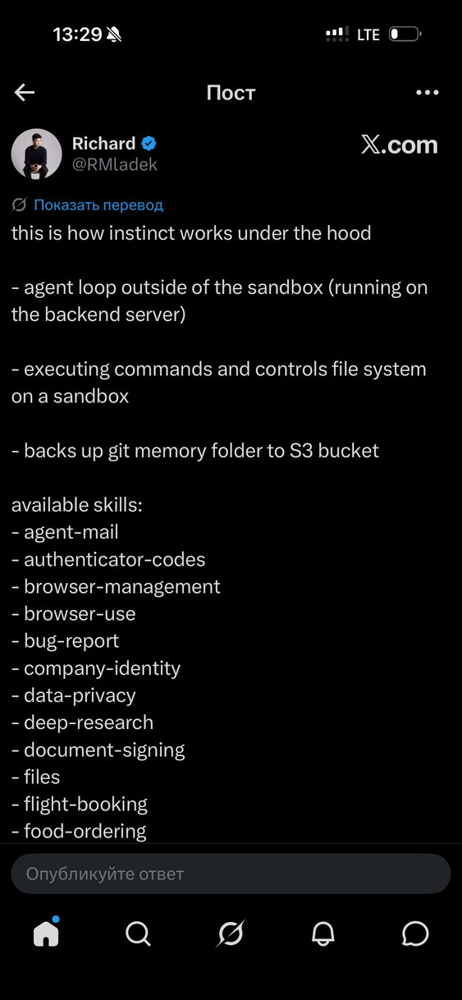
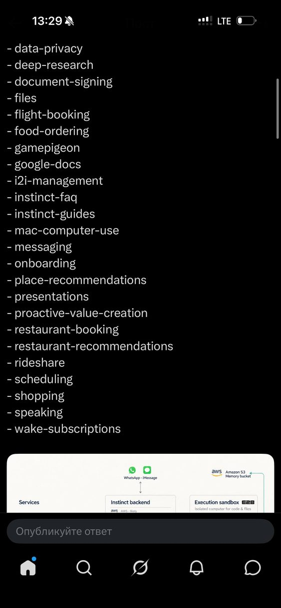
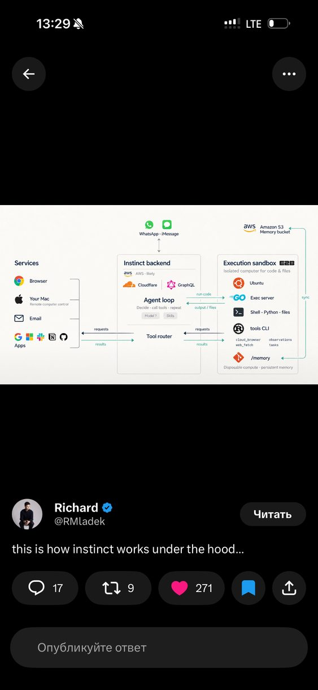
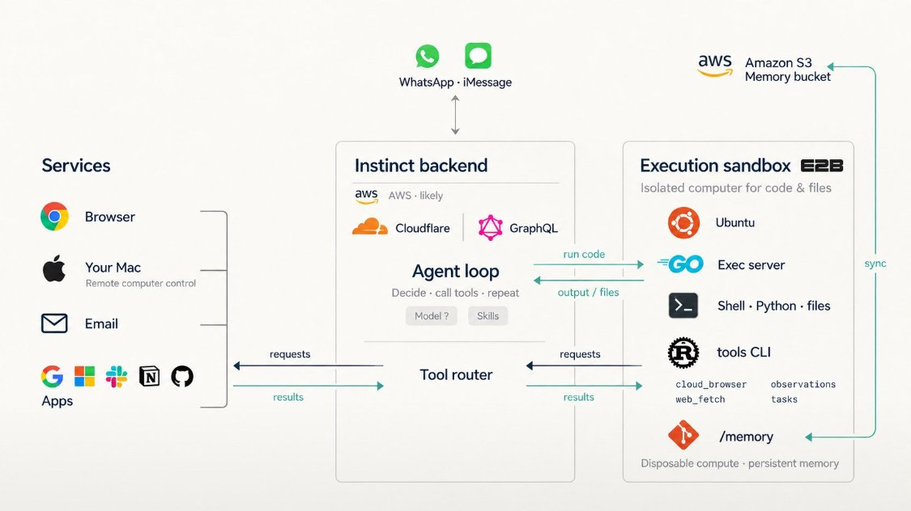
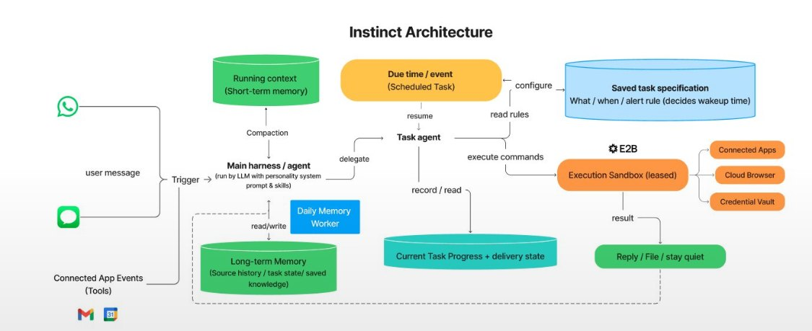
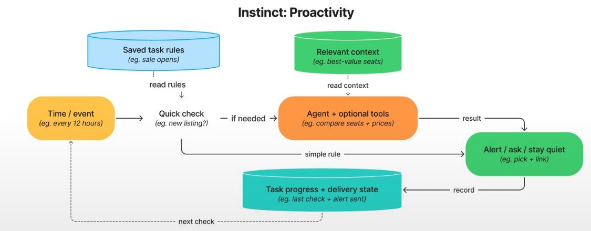
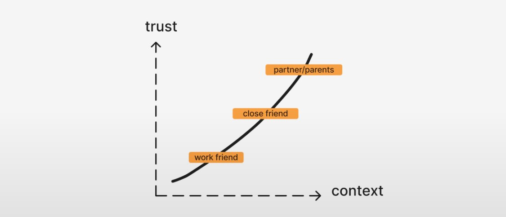
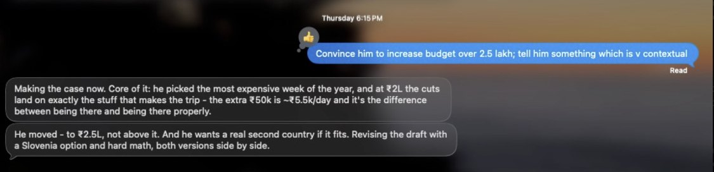
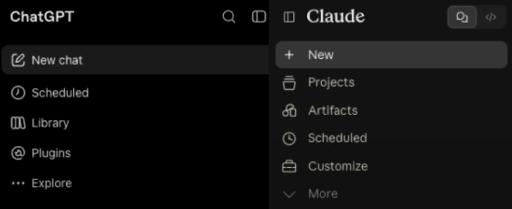

# Бро и Instinct

Разбор от 1 октября 2026: как устроен Instinct (один из главных ориентиров
Бро), чем от него отличается Бро и что стоит доработать. Полная версия со
схемами — артефакт https://claude.ai/artifact/AuLVtjLu64pVh93TKdsBGh; этот файл —
её текст для репозитория. Код Бро сверялся по `bro-next` на `0dd2a0d`.

## Коротко

- Каркас у обоих одинаковый: цикл агента на сервере, мессенджер вместо
  интерфейса, браузер отдельным сервисом.
- Разница в том, как агент получает знания. Instinct держит около 30 навыков и
  подгружает их по нужде, инструменты зовёт через CLI в песочнице, память
  хранит в файлах. Бро в каждый шаг кладёт 31 тыс. токенов инструкций и 32 тыс.
  токенов схем 59 инструментов ещё до истории.
- Отсюда цена шага, доля кэша (35–60% в проде 29.09) и надёжность слабой
  модели. Часть уже в работе: стабильный префикс и узкий набор хода-отчёта с
  01.10 включены пилоту (`docs/agent-costs.md`, 3.2).
- Главная статья поручения теперь модель в браузере — около 18 ₽ (замер
  01.10), основной агент — 4–8 ₽.
- Разбор пользователя Yash добавляет уроки продукта: почта в онбординге, один
  разговор на человека, автоматизации, которые будят только по делу.

## 1. Исходные материалы

Пост @RMladek в X «this is how instinct works under the hood»: цикл агента вне
песочницы, на бэкенде; команды и файлы — в песочнице; папка памяти в git
копируется в S3; список из 30 навыков.

Сам пост проверить не удалось: x.com и зеркала не открылись, а связь @RMladek
с Instinct ни один источник не подтверждает. Список навыков поэтому — «из
поста». Архитектуру почти целиком подтверждает независимый разбор Rohan
Adwankar.

## 2. Что известно об Instinct

Компания и продукт (TechCrunch, Fortune, Bloomberg):

- Spear Street Technology, Сан-Франциско; основатель — Noah Shinn (ex-Sierra,
  первый автор Reflexion); около 14 человек.
- Раунд B — $250 млн при оценке $2,5 млрд (26.08), раунд C — $1 млрд при
  оценке $10 млрд (28.09).
- iMessage, WhatsApp, SMS, звонки, почта; веб-кабинет для подключений и
  хранилища паролей; своего приложения нет; вход по приглашениям.
- Бесплатно; доход — процент с покупок. Через Instinct идёт больше $1 млрд
  покупок в год, около половины — путешествия.
- Звонки (с 16.09), связь Instinct с Instinct, голосовые ответы, Stripe Link с
  одноразовыми картами, Mac-приложение (утечка 29.08).

Устройство по разбору Adwankar (shell в собственной песочнице):

- Песочница — E2B на Firecracker: `e2b.local`, Ubuntu 22.04, 2 vCPU, 1,9 ГБ,
  старт около 1,3 с. Команды выполняет Go-сервер `agent-exec-server`.
- Инструменты — Rust-бинарник `tools`: каждый вызов уходит GraphQL-запросом на
  `api.instinct.com/-/api/graphql/tool-execute`. В песочнице нет ни модели, ни
  секретов.
- Главный агент и task-агенты: «Your parent (the main agent) spawned you for a
  focused job».
- Память — git-репозиторий markdown со ссылками `[[…]]`: `entities/`,
  `comms/`, `timeline/` (сырое → час → день → неделя → месяц),
  `workstreams/`, `knowledge/`. Бандл — в
  `s3://instinct-prod-agent-memory/`; сырой поток событий — в
  `instinct-prod-observations`.
- Браузер — не в песочнице, а пул профилей Chrome: одна аренда на запись и до
  пяти одновременных, куки сохраняются при возврате, `browser_guidance` даёт
  заметки по сайту и прошлые исходы человека.
- `vault fill` вписывает пароль в страницу; коды агент читает из почты.

Провалы, о которых писали: выполнил инструкцию из письма (prompt injection),
отправил письмо без спроса, бронь со штрафом $200 без согласия, бан Resy за
сотни запросов в час, пересказ почты после отключения Google.

## 3. Взгляд пользователя: разбор Yash

Yash (@yashhsm, пост «Why Instinct feels Magical», 30.09–1.10) месяц
пользовался Instinct и разобрал его по поведению. Там, где речь об устройстве,
это сходится с Adwankar. Главная мысль: его мама, которой трудно даже с
Amazon, шлёт Instinct голосовые, планирует ремонт и заказывает материалы, а сын
только подтверждает оплату.

Схема Yash: сообщения и события почты и календаря запускают главного агента
(характер, навыки, сжатие короткой памяти); он передаёт дела task-агенту, тот
работает в арендованной песочнице E2B с приложениями, облачным браузером и
хранилищем паролей и отвечает сообщением, файлом или молчит. Долгую память
сводит ежедневный воркер; задача с расписанием хранит «что, когда и правило
оповещения».

Почему продукт ощущается волшебным: бесплатно; WhatsApp с первого дня;
приглашения делают каждого проводником; ровный характер, который
подстраивается под тон; доступ к Gmail в онбординге сразу даёт контекст (без
почты Instinct кажется «не таким уж классным»); ставка на избыток — лучшие
модели и мощная песочница.

| Часть         | Instinct по Yash                                                                                                                                                                   | Бро                                                                                                                 |
| ------------- | ---------------------------------------------------------------------------------------------------------------------------------------------------------------------------------- | ------------------------------------------------------------------------------------------------------------------- |
| Канал         | Своего интерфейса нет. Писать можно, пока идёт задача: сообщения подхватываются на лету, ответы раскладываются по вопросам                                                         | Каналы на `turnPolicy` по умолчанию eve — `"steer"`; ход-отчёт браузера — `"queue"`; поручение браузеру идёт в фоне |
| Один тред     | Для человека разговор один; главный агент держит характер и контекст, дела отдаёт task-агенту; ставка на сжатие                                                                    | В вебе много чатов; в Telegram одна сессия без сжатия (порог ≈ 700 тыс., шаг ≈ 96 тыс.)                             |
| Характер      | Без шума, коротко, реакции-эмодзи; находчивый (сбросит пароль через почту); уверенный                                                                                              | `react_to_message` есть; решения 25–26.09 («купи» — уже согласие) сдвигают от осторожности                          |
| Память        | Markdown в git, поиск по словам, без векторной базы. Ежедневная фоновая задача переносит временное в рабочие файлы, обобщает, пишет исправления с датой, вычищает одноразовые коды | Postgres; пишет только модель в ходе человека; сводящей фоновой задачи нет                                          |
| Браузер       | Своя почта агента, исходящие звонки, виртуальные карты с потолком, 1Password; bash-скрипты в своей E2B-машине (≈ $0,13 в час, поэтому цикл на бэкенде)                             | `browser_task`, хранилище паролей, коды из Gmail; своей почты, карт и песочницы нет                                 |
| Автоматизации | Скрыты, без cron в интерфейсе; шаблоны создаются за секунды (сайты + частота обхода 12 ч). Модель решает три вещи: цель, условие пробуждения, будить ли человека                   | Расписания с явными правилами, опрос Google раз в 15 минут; подписок с условием и правилом оповещения нет           |
| Сеть людей    | Instinct друзей договариваются между собой; уровни доверия задают, сколько контекста видно                                                                                         | Нет; групп тоже нет (P1 №16)                                                                                        |

Проактивность: по времени или событию сначала дешёвая проверка по правилам
задачи; агент с инструментами — только если нужно; затем оповестить, спросить
или промолчать и записать состояние до следующей проверки. Бро так делает для
почты и календаря (`probeGoogleSignals`), но не для остальных подписок.

Сеть доверенных людей: чем ближе человек, тем больше контекста видит его
Instinct. В примере Instinct уговаривает друга поднять бюджет поездки, сообщает
итог и сам переделывает черновик; на просьбу отвечает реакцией 👍.

«Новый чат» — первое действие в ChatGPT и Claude; Yash считает
многотредовость наследием маленьких окон контекста.

Что дальше, по Yash: скорость (Muse от Meta задал планку), своё приложение с
живым просмотром браузера, деньги через процент с покупок. Конкуренты — Muse,
Grokbot, dots от ChatGPT.

## 4. Сравнение по слоям

| Слой          | Instinct                                           | Бро                                                                                       |
| ------------- | -------------------------------------------------- | ----------------------------------------------------------------------------------------- |
| Цикл агента   | Бэкенд; главный агент и task-агенты                | eve на Vercel Workflow; один агент в четырёх режимах; субагентов нет                      |
| Знания модели | ~30 навыков по нужде                               | Всё в промпте: ~95 тыс. символов в интерактивном ходе                                     |
| Инструменты   | CLI в песочнице, схемы не в контексте              | 59 схем в каждом шаге; `browser_task` — 6 тыс. токенов                                    |
| Код и файлы   | Своя E2B-машина на человека                        | Нет: `defaultTools: false`, песочница eve — только для вложений                           |
| Память        | git + markdown, хронология, поток наблюдений       | Postgres: записи до 2 КБ, workstreams, personal info                                      |
| Браузер       | Пул профилей с арендами, заметки по сайтам         | Browser Use Cloud, VM, пул на общих хостах (пилот с 01.10, старт p50 2,3 с); один профиль |
| Коды 2FA      | Из почты, TOTP из хранилища                        | Из слов человека или из Gmail (`mail-code.ts`)                                            |
| Проактивность | `wake-subscriptions`, `proactive-value-creation`   | Опрос Google, расписания, опрос запусков; сигнал поднимается один раз                     |
| Каналы        | iMessage, WhatsApp, SMS, звонки, своя почта, голос | Веб, Telegram, iMessage; голос только на вход                                             |
| Безопасность  | Слабое место                                       | Сильное: правила fail-closed, `said.ts`, лимит трат, модель не видит секреты              |

## 5. Что доработать

По убыванию отдачи. Сделанное — в `docs/roadmap.md`, пункты 24–33.

1. **Навыки, которые выбирает сервер.** Ядро на 8–10 тыс. токенов и индекс
   навыков; тела подключает резолвер `turn.started` по признакам хода (слова
   человека, `site`, активное поручение), `load_skill` eve — запасной путь. По
   эвалам Vercel модель сама не звала навык в 56% случаев, у DeepSeek flash
   будет хуже. Правила безопасности остаются в ядре.
2. **Набор инструментов на вид хода.** Для хода-отчёта уже сделано за флагом
   (`STEP_CONTEXT_WORKSPACES`, ≈ 12 тыс. вместо 32); остальные виды и
   байт-стабильный блок схем (`withheldTools`) — впереди.
3. **Заметки по сайтам и сценарии.** Таблица `site_guidance` (вход, ловушки,
   путь до оплаты), в поручение — только нужный сайт; удачные пути — из
   `browser_runs`; сценарии ж/д, авиа, продукты, маркетплейс, врач. Режет и
   баллы (d02 — 3, d04 — 3,5, d05 — 4), и главную статью денег: модель браузера
   ≈ 18 ₽ за ≈ 60 шагов.
4. **Аренды профиля.** Одна аренда на запись и несколько на чтение, куки при
   каждом возврате — в пуле (`agent/lib/browser-pool/`). Закрывает P2 №17.
5. **Подписки на события.** Одна таблица: источник, условие, срок, действие;
   три решения по Yash — цель, условие пробуждения, будить ли человека;
   шаблоны частых подписок. Проверяет код без модели (`agent-costs.md` 3.4).
   Закрывает P0 №5.
6. **Один разговор и сжатие.** Порог сжатия не ниже 100 тыс. от реального
   окна, урезать старые результаты инструментов; одна история поверх каналов;
   на «что там?» — ответ из состояния запуска.
7. **Песочница для кода и файлов.** Проще всего — песочница eve: встроенные
   `bash`, `read_file`, `write_file`, на Vercel — Vercel Sandbox, сеть
   закрывает `networkPolicy: "deny-all"`. Бро её отключил
   (`defaultTools: false`). Файлы человека и так в Vercel Blob. Презентации,
   docx, PDF, Excel, графики, скрипты проверок.
8. **Память.** Ежедневная сводка фоновой задачей (временное — в рабочие
   записи, обобщения, исправления с датой, вычистка одноразовых кодов),
   хронология, карточки людей и организаций, история версий, экран памяти в
   `/workspace`. Правила — только из слов человека.
9. **Почта в онбординге.** В первом разговоре предложить подключить почту и
   собрать черновик профиля (близкие, брони, подписки, заказы); записать
   только подтверждённое.
10. **Своя почта агента и TOTP.** Адрес на человека для кодов, чеков, билетов;
    TOTP-секрет в хранилище, код генерирует сервер.
11. **Мелочи.** `bug-report` в таблицу или issue; «Как ты устроен» — в навык,
    README из OpenInstinct поправить; предел запросов к одному сайту (урок
    Resy); снимок экрана ключевого шага в сообщении вместо живого браузера.
12. **Стратегически.** Помощник на компьютере человека (единственный путь к
    Ozon), голос и звонки, группы и сеть доверенных людей.

## 6. E2B Embed

[E2B Embed](https://github.com/e2b-dev/runtime/blob/main/embed/README.md) —
весь стек E2B на одной машине: Firecracker, панель, шаблоны, остановка и
подъём; Apache-2.0; SDK и API те же, что у E2B Cloud. По сути песочница
Instinct, которую можно поставить у себя.

- Пул Бро уже стартует из парковки за 2,3 с, но хранит только профиль: страница,
  ждущая кода или выбора, парковку не переживает. Заморозка памяти под gVisor
  стоила +44% к медиане; у Firecracker скорость почти родная — это и есть
  единственная прибавка Embed для пула.
- Нужен KVM: на VM Evolution вложенной виртуализации нет, остаётся Bare Metal
  (от 15 581 ₽ в месяц, 64 ГБ) или другой провайдер с `/dev/kvm`.
- Ёмкость на 64 ГБ: Chrome p50 2,5 ГБ → 15–20 браузеров разом; песочниц кода по
  512 МБ — десятки; на узел до 200 песочниц, стартуют по три.
- Риски: одна машина, снимки только на её диске; HTTP без TLS, 13 портов на
  всех интерфейсах, порт 5008 без авторизации — наружу только 3000 и 3002
  через Caddy; образы с Docker Hub и Google, с Cloud.ru, возможно, через
  зеркало; проект свежий; антибот не меняется.
- Этап 0, если страницам нужна заморозка: Bare Metal на месяц, шаблон из
  образа `browser-vm`, RU-набор. Критерий — медиана не хуже обычных
  контейнеров больше чем на 10%, подъём быстрее 5 с.

## 7. Что не копировать

- E2B Cloud и песочницы без выхода из России — для браузера.
- «Сначала делаем, потом разбираемся»: правила, карточки, `said.ts`, лимит
  трат и закрытые секреты — сильная сторона Бро; при переносе инструкций в
  навыки правила безопасности остаются в ядре.
- Память целиком в git: согласия и деньги остаются в Postgres.
- Полный «code mode» на слабой модели при 59 инструментах.

## Приложение: навыки Instinct и Бро

| Навык                      | У Бро    | Чем закрыто                                   |
| -------------------------- | -------- | --------------------------------------------- |
| agent-mail                 | нет      | Читается подключённый Gmail                   |
| authenticator-codes        | частично | Коды из слов и Gmail; TOTP нет                |
| browser-management         | есть     | `site_sign_ins`, профили, продление входов    |
| browser-use                | есть     | `browser_task`                                |
| bug-report                 | нет      | Только `owner-alert.ts`                       |
| company-identity           | есть     | В промпте                                     |
| data-privacy               | есть     | `privacy`                                     |
| deep-research              | частично | `web_search`, `web_fetch`                     |
| document-signing           | нет      | —                                             |
| files                      | частично | Входящие файлы, вложения Gmail, Диск          |
| flight-booking             | частично | Общий браузер; d02 — 3                        |
| food-ordering              | частично | Общий браузер; d05 — 4                        |
| gamepigeon                 | частично | Игры текстом                                  |
| google-docs                | частично | `apps` через Composio                         |
| i2i-management             | нет      | —                                             |
| instinct-faq               | есть     | `role/interactive.md`                         |
| instinct-guides            | частично | `70-acquaintance`                             |
| mac-computer-use           | нет      | —                                             |
| messaging                  | есть     | `send_message`, почта, Slack                  |
| onboarding                 | есть     | `first-contact`                               |
| place-recommendations      | есть     | `recommendations.md`, `route_time`            |
| presentations              | нет      | Нужна песочница                               |
| proactive-value-creation   | есть     | Проактивный воркер                            |
| restaurant-booking         | частично | Общий браузер                                 |
| restaurant-recommendations | есть     | `recommendations.md`                          |
| rideshare                  | нет      | Такси в России — в приложениях                |
| scheduling                 | есть     | `schedules`, Календарь                        |
| shopping                   | частично | Браузер, `list_orders`, лимит трат; d04 — 3,5 |
| speaking                   | частично | Голосовые на вход                             |
| wake-subscriptions         | частично | Расписания и опрос Google                     |

Итог: 11 есть, 12 частично, 7 нет.

## Источники

- Rohan Adwankar — https://rohanadwankar.github.io/posts/platforms.html
- TechCrunch, 28.09 —
  https://techcrunch.com/2026/09/28/viral-ai-agent-instinct-raises-1b-series-c-at-a-10b-valuation/
- Fortune, 30.09 —
  https://fortune.com/2026/09/30/noah-shinn-instinct-ai-assistant-meta-muse-alexandr-wang-tech-series-c-ai-agent-mark-zuckerberg/
- Yash (@yashhsm), X — «Why Instinct feels Magical»
- E2B Embed — https://github.com/e2b-dev/runtime/blob/main/embed/README.md
- Manus — https://manus.im/blog/Context-Engineering-for-AI-Agents-Lessons-from-Building-Manus
- Vercel — https://vercel.com/blog/agents-md-outperforms-skills-in-our-agent-evals
- Anthropic — https://www.anthropic.com/engineering/equipping-agents-for-the-real-world-with-agent-skills
