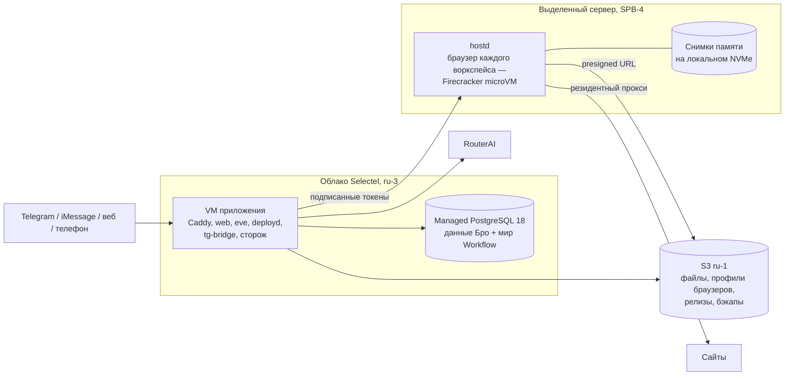

# Переезд с Cloud.ru на Selectel

Решение владельца 09.10: весь прод Бро переезжает в Selectel. Здесь — целевая
схема, чем она отличается от первоначального эскиза, порядок переезда с
откатом на каждом шаге и что ещё не проверено.

## Целевая схема

- **VM приложения** — облачная VM `HFL1.2-8192-160` (высокочастотный CPU,
  локальный диск). Данных на ней нет: база managed, файлы в S3. Поэтому код
  хоста меняют пересозданием VM (`host.py create`), а релизы, как и раньше,
  приходят через `deployd`.
- **База** — managed PostgreSQL 18 Selectel в приватной сети `bro-net`
  (`bro_app`, базы `bro` и `bro_workflow`, локаль `C.UTF-8`). Шаг мира
  Workflow делает десятки запросов, поэтому база стоит в той же зоне, что и VM.
- **Браузеры** — один выделенный сервер, всегда включённый. `hostd` получает
  третью среду, `firecracker`: каждая песочница — microVM со своим ядром
  (`browser-vm/firecracker/`). Профиль Chrome — диск microVM, при парковке он
  уходит в S3, как сейчас. Снимок памяти остаётся на NVMe сервера, и
  восстановление с открытыми страницами занимает десятки миллисекунд вместо
  холодного старта Chrome. Пул в Бро — режим постоянных хостов
  (`BROWSER_HOST_CLOUD=static`, `BROWSER_HOST_STATIC`): Бро не создаёт и не
  будит VM, хост всегда готов.
- **S3** — бакет `bro-bucket` в ru-1. Адрес, регион и ключ задают настройки
  `S3_ENDPOINT`, `S3_REGION`, `S3_ACCESS_KEY_ID` и `S3_SECRET_ACCESS_KEY`.
- **Песочницы кода** (task-агент) пока остаются на `sbx-code-2` в Cloud.ru:
  приложение ходит к ним по адресу, провайдер не важен. Перенос на
  выделенный сервер — следующий шаг, тоже в Firecracker.

Сессия не может зайти на сервер по SSH, поэтому сервер настраивается только
cloud-init при установке ОС (`scripts/selectel/dedicated.py reinstall`), а
код `hostd` обновляется подписанным запросом самого `hostd`.

## Чем отличается от эскиза

| Пункт эскиза                           | Решение   | Почему                                                                                                                                                                                                                                                                                                |
| -------------------------------------- | --------- | ----------------------------------------------------------------------------------------------------------------------------------------------------------------------------------------------------------------------------------------------------------------------------------------------------- |
| Выделенный сервер с Firecracker        | да        | Решение владельца 09.10 после его замеров: холодный старт microVM — 80 мс ядро и 0,5 с до сети, восстановление из снимка — ~20 мс, Chromium внутри отдаёт страницу за 0,4–0,6 с. Сервер всегда включён, и пропадает ожидание хоста: на Cloud.ru создание хоста занимало 5–16 минут, включение — 92 с. |
| Redis для очередей, cron и событий     | не нужен  | Очередь, cron и долгие ходы eve уже держит мир Workflow в Postgres (graphile-worker). Второе хранилище очередей — это ещё одна точка отказа и переписывание eve ради миллисекунд при шаге модели в секунды.                                                                                           |
| pgvector                               | не сейчас | Память ищет по тексту и ключам (`docs/memory.md`), векторного поиска в коде нет. Расширение можно включить в managed PostgreSQL позже.                                                                                                                                                                |
| Egress-прокси (Squid или Envoy)        | уже есть  | Браузер выходит только через резидентный прокси (`BROWSER_VM_PROXY`); всё остальное из песочницы, а также приватные сети и metadata, режет nftables хоста (`browser-vm/host/network.py`). Секреты подставляет worker, модель их не видит.                                                             |
| Postgres «почти бесплатно» на своей VM | managed   | В VM приложения не зайти по SSH: сломанный Postgres там некому чинить. Хост приложения уже умеет внешнюю базу. Самостоятельный Postgres — возможная экономия ~5 тыс. ₽ в месяц позже.                                                                                                                 |

Из Instinct (`docs/instinct.md`) берём устройство, а не стек: агент на
бэкенде, песочница — только инструменты, отдельный пул браузеров с арендой
профиля. Всё это у Бро уже есть.

## Где скорость

1. **Хост браузера.** Выделенный сервер всегда включён, а microVM
   восстанавливается из снимка памяти с открытыми страницами. Очередь
   поручений больше не ждёт создания или включения хоста.
2. **Сеть до RouterAI.** Шаг Бро весит ~250 КБ; 03.10 маршрут Cloud.ru →
   RouterAI терял до 40% пакетов. С VM Selectel замер повторяется до
   переключения.
3. **База рядом с приложением.** Та же зона, приватная сеть.
4. **CPU приложения.** eve в основном однопоточный: высокочастотный флейвор
   ускоряет каждый шаг.

## Порядок переезда

Каждый шаг можно откатить, пока не сделан следующий. Прод на Cloud.ru
работает до переключения DNS.

1. **S3.** Код с настройками S3 выкатывается на Cloud.ru без изменения
   поведения: настройки пустые. Затем живые данные копируются в
   `bro-bucket`: `artifacts/`, `sandbox/`, `sets/`, текущий корень и бандл
   хоста, `app/vendor/`, последние бэкапы.
2. **Выделенный сервер.** Ставится ОС с cloud-init хоста
   (`bro-dedicated-1`), проверяется стендом `hostd`: старт, парковка,
   восстановление, поручение.
3. **Сеть и база в Selectel.** `scripts/selectel/cloud.py network`,
   `BRO_CLOUD=selectel python host.py pg create | users | databases`.
4. **VM приложения.** `BRO_CLOUD=selectel python host.py create bro-app-sel-1`,
   `host.py env`, `host.py deploy`. Проверка — на имени `<ip>.sslip.io`, без
   людей.
5. **Переключение.** Короткое окно:
   - остановить мост Telegram и eve на Cloud.ru;
   - снять финальный бэкап и восстановить его в Selectel;
   - сменить A-запись `brobro.tech` на адрес VM Selectel (Vercel DNS);
   - запустить мост Telegram на новой VM;
   - проверить ход в Telegram и вебхуки телефонии.

   Откат: вернуть A-запись и запустить мост и eve на Cloud.ru. Записи,
   сделанные в Selectel после переключения, при этом теряются.

6. **Уборка Cloud.ru** — не раньше чем через неделю стабильной работы и только
   с разрешения владельца: `bro-app-1`, `sbx-code-2` и базу прода правила
   запрещают удалять без него.

## Что проверить на живой инфраструктуре

- **Firecracker на хосте Ubuntu 22.04.** Ядро 5.15 не входит в список хостов,
  которые проверяет Firecracker (5.10, 6.1, 6.18), и снимок
  восстанавливается только на том же CPU и ядре.
- **Telegram.** Доступен ли `api.telegram.org` с адреса Selectel. Если да,
  `tg-egress` (обход сети Cloud.ru) не нужен, но мост `getUpdates` остаётся.
- **RouterAI.** Скорость и потери до `routerai.ru` с телом 250 КБ.
- **Вебхуки и Composio.** Доходят ли Exolve, ElevenLabs и Composio до VM и
  обратно.
- **Баланс.** Selectel блокирует услуги при нулевом балансе, в том числе S3.
  Прод переключается только при балансе на месяц вперёд.
