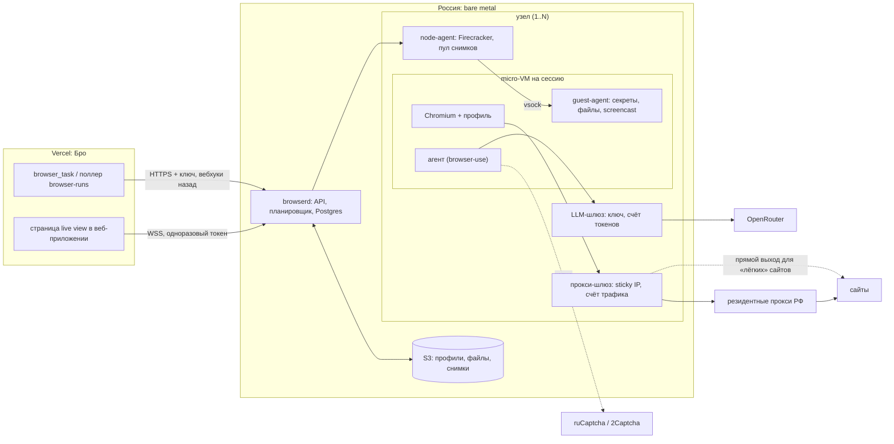

# Свой браузер вместо Browser Use Cloud

Проект архитектуры: браузерные поручения Бро выполняются на своих серверах в
России, у каждого поручения своя микро-VM. Документ описывает, что именно
заменяем, из каких частей строим, как переезжаем без большого переписывания и
когда это окупается. Цифры рынка — на сентябрь 2026 года, ссылки в конце.

## Что на самом деле даёт Browser Use сейчас

Бро пользуется API v4 (`agent/lib/browser-use/client.ts`) и получает от него
не браузер, а целого агента: текст поручения и имя модели на входе, итоговый
текст с метками `RESULT:`/`NEEDS:`/`ITEMS:` на выходе. Всё, что нужно
повторить:

| Возможность Browser Use                                  | Где на неё опирается Бро                                     |
| -------------------------------------------------------- | ------------------------------------------------------------ |
| Цикл LLM-агента по тексту поручения                      | `composeBrowserTask`, `outcome.ts`                           |
| Сессия: следующий запуск в том же браузере и с памятью   | `browser_task.ts` (продолжение), `POST /sessions/{id}/queue` |
| Профиль воркспейса (куки, localStorage)                  | `browser_profiles`, `sign-ins.ts`                            |
| Секреты по алиасу с белым списком доменов                | `secrets.ts`, `mail-code.ts`                                 |
| Резидентный прокси по стране или свой прокси             | `proxy.ts`                                                   |
| Решение капчи                                            | промпт, `captcha-retry.ts`                                   |
| Live view для 3DS, пуша и ручного входа                  | событие `browser.ready`                                      |
| CDP живого браузера после конца запуска                  | `cdp.ts` (ввод кода, скриншот, визиты продления входа)       |
| Файлы запуска (`report/final.png`, фото товаров)         | `images.ts`                                                  |
| Потолок стоимости запуска, 429 при лимите, 402 без денег | `maxCostUsd`, `queue.ts`, `credits.ts`                       |

И обходные пути, которые появились из-за ограничений Browser Use и уйдут со
своим сервисом:

- нет состояния «ждёт ввода» — запуск кончается с `NEEDS: sms_code`, браузер
  висит, код набираем сами через CDP (`personStepLine`, `cdp.ts`);
- куки ложатся в профиль только при чистой остановке, облако гасит браузер
  через ~20 минут простоя и через 4 часа — отсюда 15-минутный таймер
  `release.ts` и P2 №17 в `docs/roadmap.md`;
- нет идемпотентности `POST /runs` — строка-метка в тексте поручения и поиск
  по `GET /runs`;
- у v4 нет вебхуков — только поллер раз в минуту;
- 5 одновременных сессий на аккаунт (`docs/benchmarks/README.md`).

## Честно про деньги

Прайс Browser Use сейчас: браузер — $0.02 в час, агент — токены модели плюс
20% сбора, их резидентный прокси — $5 за ГБ, свой прокси — $0.20 за ГБ.
Значит, время браузера почти бесплатно, и своя инфраструктура экономит только:

1. **20% сбора с токенов.** Сами токены остаются: модель нужна и своему агенту
   (через OpenRouter, как у остального Бро).
2. **Наценку на прокси.** Российские резидентные прокси стоят $1.2–4 за ГБ
   (мобильные — дороже). Но это доступно и без своей инфраструктуры: у Бро
   уже есть `BROWSER_USE_PROXY_*` (см. этап 0).

Против этого — постоянные расходы: сервер в месяц, минимальный пакет прокси,
капча-сервис и главное — время на эксплуатацию (обновление Chromium, дежурство,
антибот-гонка). Грубая оценка: при экономии ~$0.3–0.5 на запуске своя
инфраструктура окупается от ~1–2 тысяч поручений в месяц. При сегодняшних
объёмах (прогоны бенчмарков, единицы пользователей) дешевле она не будет.

**«Платить за время работы» на своём железе не получится.** Firecracker
требует KVM, а российские облака с посекундной оплатой вложенную виртуализацию
не дают: Yandex Cloud и облачные серверы Selectel её явно не поддерживают и
отправляют на bare metal, который оплачивается помесячно (или посуточно у
Timeweb). Микро-VM даёт изоляцию и снимки, а не посекундный счёт. Эластичность
дешевле получить гибридом: свои серверы держат обычную нагрузку, пик уходит в
Browser Use Cloud.

**Поэтому переезд оправдывают не деньги, а:**

- российский адрес и данные в России: куки Госуслуг, Ozon и банков, скриншоты с
  личными данными сейчас лежат у американской компании (152-ФЗ, риск санкций и
  оплаты); ЕСИА не пускает с зарубежных адресов;
- контроль над поведением: настоящее «ждёт ввода», VM на паузе вместо таймера
  в 15 минут, профиль без остановки браузера, идемпотентность, вебхуки;
- свои лимиты параллельности вместо 429 на пятой сессии;
- свои правки агента под российские сайты.

**Главный риск — качество агента.** По бенчмаркам самого Browser Use облачный
агент (свой агент, модель, стелс, капча) решает задачи заметно лучше, чем
открытая библиотека `browser-use` с лучшей сторонней моделью (78% против ~63%
в их январском тесте). Этот разрыв придётся закрывать самим, поэтому первый
этап — замер на наших кейсах, а не инфраструктура.

## Архитектура

### browserd — управляющий сервис

Один сервис на небольшой VM или прямо на первом узле: REST API, планировщик
размещения, Postgres со своими таблицами (сессии, запуски, события, профили,
счётчики трат), S3 (Selectel или Yandex Object Storage) для образов профилей,
файлов запусков и снимков VM.

**API — совместимое подмножество Browser Use v4.** Бро уже читает базовый адрес
из `BROWSER_USE_BASE_URL` (`shared/environment/env.ts`), поэтому первый выпуск
browserd реализует ровно то, что зовёт `client.ts`, с теми же схемами и кодами
(409 — сессия занята, 400/404 — сессии нет, 429 — нет мест, 402 — кончился
бюджет):

- `POST /runs`, `GET /runs`, `GET /runs/{id}`, `GET /runs/{id}/status`,
  `GET /runs/{id}/events` (событие `browser.ready` с `live_view_url`),
  `POST /runs/{id}/cancel`;
- `POST /sessions/{id}/queue`, `GET /sessions/{id}`;
- `GET /browsers?agentSessionId=…&filterBy=active`, `POST /browsers`,
  `PATCH /browsers/{id}` (`stop`) — с `cdpUrl`, который проксирует browserd;
- `POST /profiles`, `DELETE /profiles/{id}`;
- `GET /workspaces/{id}/files?prefix=report/&includeUrls=true`.

Тогда переключение — смена переменных окружения, а Browser Use остаётся
запасным вариантом тем же кодом. Расширения поверх v4 (ниже) Бро начинает
использовать постепенно, за флагом.

**Расширения, ради которых всё затевается:**

- `Idempotency-Key` на `POST /runs` и `POST /browsers` — вместо строк-меток;
- статус `waiting_input` и `POST /runs/{id}/input {kind, value}`: агент зовёт
  инструмент «нужен код», цикл встаёт, VM паркуется (см. ниже), код приходит
  секретом и набирается без LLM, агент продолжает тот же запуск;
- `POST /profiles/{id}/checkpoint` — сохранить профиль, не останавливая
  браузер (закрывает P2 №17);
- вебхуки на смену статуса с HMAC — формат уже умеет
  `agent/channels/browser-use.ts`; поллер остаётся страховкой;
- реальная стоимость запуска в ответе: токены из LLM-шлюза и байты из
  прокси-шлюза.

### Узел и микро-VM

**Железо.** Выделенный сервер в Москве (Selectel, Timeweb, Yandex BareMetal):
например, 32 ядра / 64 потока, 256 ГБ RAM, 2×NVMe. Chromium с тяжёлыми
российскими сайтами занимает 0.5–1.5 ГБ, агент — ~200 МБ, поэтому VM —
2 vCPU (с переподпиской) и 2 ГБ RAM, а на узле — 40–60 одновременных сессий с
запасом. Сейчас Бро упирается в 5. Для надёжности — второй узел в другом ДЦ
или Browser Use как запасной.

**Изоляция — Firecracker.** Каждая сессия — отдельная VM под `jailer`: свой
cgroup, сетевой namespace и tap-интерфейс. Выход из VM разрешён только к
прокси-шлюзу, LLM-шлюзу и капча-сервису (nftables на узле); к соседним VM,
узлу и внутренней сети — нет. На одном узле живут куки и секреты разных людей,
а Chromium открывает недоверенные страницы, поэтому граница — ядро, а не
контейнер.

**Быстрый старт — снимки.** node-agent один раз загружает образ, запускает
Chromium, ждёт готовности CDP и снимает VM. Новая сессия — восстановление
снимка (у BaseLayer ~130 мс, у Browser Use 3.1 с вместо 9.8 с) и подключение
диска профиля. После восстановления надо поправить часы гостя: снимок
восстанавливает время момента съёмки.

**Парковка вместо таймера.** Когда агент ждёт код или решение человека,
node-agent ставит VM на паузу и снимает её на NVMe (память + состояние). VM
не ест CPU и RAM, пока человек не ответит; ответ её возобновляет. Это
заменяет 15-минутную остановку `release.ts` и повторный вход после неё. Срок
хранения припаркованной VM — часы (сайты всё равно истекают сессии), дальше
чистая остановка с сохранением профиля.

**Гость.** Минимальный Linux, Chromium и три процесса:

- **Chromium** в headful-режиме на Xvfb (в сравнениях антидетекта 2026 года
  headful заметно реже ловят, чем headless) со стелс-патчами уровня
  Patchright/nodriver: без `navigator.webdriver`, без утечек CDP, с настоящим
  UA и шрифтами. Часовой пояс, язык и геолокация — Москва, под российский
  выход.
- **Агент** — открытая библиотека `browser-use` (MIT), модель через LLM-шлюз.
  Промпт `composeBrowserTask` и метки итога переиспользуются как есть.
  Кандидаты модели: текущая `gpt-5.6-luna`, Claude, DeepSeek — выбирает замер
  этапа 1.
- **guest-agent** — связь с узлом по vsock: монтирует профиль, выгружает файлы
  `report/*` в S3, отдаёт screencast для live view и **набирает секреты**. LLM
  видит только алиас (`<secret>card_number</secret>`); значение приходит в
  guest-agent, и он вводит его через CDP `Input.insertText`, только если
  origin фрейма в белом списке домена секрета. Так сохраняется контракт
  `secretBindings`, а ключ OpenRouter и значения секретов в память агента не
  попадают.

### Профили

Профиль воркспейса — отдельный образ диска (ext4) с `user-data-dir`,
зашифрованный ключом воркспейса и лежащий в S3. VM получает его вторым
virtio-диском; при чистой остановке и по `checkpoint` guest-agent просит
Chromium сбросить хранилища, делает `sync`, узел выгружает образ (или только
изменённые блоки). Два запуска на один профиль одновременно не монтируются:
вторая сессия ждёт, как сейчас ждёт `accountInUse` в `sign-ins.ts`, либо
получает копию только для чтения. «Забыть входы» удаляет образ.

### Сеть: прокси-шлюз

Chromium выходит в интернет только через прокси-шлюз на узле (например,
`gost` или `3proxy` с цепочкой к провайдеру). Шлюз:

- держит **постоянный адрес на пару «воркспейс + аккаунт»** — sticky-сессия
  провайдера по имени пользователя. Новый адрес на каждый браузер — лишние
  коды входа: ЕСИА спрашивает код с каждого нового адреса;
- выбирает выход по сайту: антибот-сайты (Ozon, Wildberries, Авито, Яндекс) —
  резидентный или мобильный прокси; остальные — прямо с российского адреса ДЦ,
  это бесплатно; отказ сайта переводит его в резидентный список;
- меняет выход на повторе после антибот-стены — логика `retryProxySettings`
  переезжает сюда;
- считает байты на запуск (для стоимости) и режет видео — визиты продления
  входа и так не грузят картинки (`cdp.ts`).

Провайдера прокси берите с российским юрлицом, sticky-сессиями до часа и
понятным происхождением адресов.

### Капча

Агент получает инструмент `solve_captcha`: guest-agent находит виджет (Yandex
SmartCaptcha, reCAPTCHA, Turnstile), отправляет в ruCaptcha/2Captcha (токен —
около $3 за тысячу) через тот же выход, что у браузера, и подставляет токен.
Не решилась — прежний путь `captcha-retry.ts` с новым адресом; человеку капчу
не показываем, как и сейчас.

### Live view

Своя страница в веб-приложении Бро вместо ссылки `live.browser-use.*`.
guest-agent шлёт кадры `Page.startScreencast` (JPEG с подтверждением кадра),
browserd раздаёт их по WSS с одноразовым токеном на запуск и принимает клики и
ввод (`Input.dispatch*`) — этого хватает для 3DS, пуша и ручного входа. Хост
live view добавить в фильтр ссылок `outcome.ts`, как сейчас
`live.browser-use.*`. Запасной вариант, если screencast будет дёргаться, —
noVNC к тому же Xvfb.

### LLM-шлюз

Прокси OpenAI-совместимого API на узле: подставляет ключ OpenRouter, считает
токены и деньги по запуску и обрывает запуск по `maxCostUsd` — сейчас этот
потолок держит Browser Use. Трафик к модели идёт мимо резидентного прокси.

## Что меняется в коде Бро

По этапам, от нуля до полного переезда:

1. **Ничего** — browserd отвечает как v4, меняются `BROWSER_USE_BASE_URL` и
   `BROWSER_USE_API_KEY`. Добавить хост своего live view в фильтр `outcome.ts`
   и поправить текст про обработчиков данных (`agent/lib/privacy/`): данные
   больше не уходят в Browser Use.
2. **Граница провайдера.** Сейчас семантика Browser Use размазана по
   `browser_task.ts`, `queue.ts`, `captcha-retry.ts`, `release.ts`, `cdp.ts`,
   `images.ts`, а первичный ключ `browser_runs` — это id запуска Browser Use.
   Когда понадобятся расширения, их стоит собрать в одном клиенте (переименовать
   каталог в `agent/lib/browser/` и держать выбор провайдера на воркспейс),
   не заводя слой абстракций заранее.
3. **Расширения за флагом:** `waiting_input` вместо `NEEDS: sms_code` +
   набора через CDP; вебхуки вместо минутного опроса; `Idempotency-Key` вместо
   строк-меток; `checkpoint` вместо 15-минутного таймера; стоимость запуска в
   `spend_entries`.

## Этапы

**Этап 0 — сейчас, без своего железа.** Купить российские резидентные прокси
со sticky-сессиями и включить их в Browser Use: `BROWSER_USE_PROXY_HOST`,
`_PORT`, `_USERNAME`, `_PASSWORD` и `BROWSER_USE_PROXY_ROTATING_USERNAME` с
`{session}`. Трафик подешевеет с $5 до $0.20 плюс цена провайдера; заодно
замерим реальные ГБ на поручение и то, как сайты принимают этого провайдера.

**Этап 1 — замер агента (2–3 недели).** Один сервер, пока без Firecracker:
Docker-контейнер с Chromium и `browser-use` на сессию, минимальный browserd с
совместимым API, прокси этапа 0. Прогнать RU-набор бенчмарка
(`docs/benchmarks/README.md`) против Browser Use Cloud на тех же кейсах.
**Критерий перехода:** не хуже облака по доле решённых кейсов и не дороже по
токенам. Не проходит — остаёмся на этапе 0 и дорабатываем агента или модель.

**Этап 2 — изоляция и состояние.** Firecracker с пулом снимков, диски профилей
в S3 с шифрованием, парковка VM, guest-agent с секретами, live view,
LLM-шлюз с потолком стоимости. Переключение воркспейсов по одному.

**Этап 3 — гибрид.** browserd сам отдаёт запуск в Browser Use, если свободных
мест нет или узел недоступен; маршрут по сайту — где своя схема стабильно
проигрывает.

**Этап 4 — собственный протокол.** Расширения API в коде Бро, удаление
обходных путей Browser Use из `browser_task.ts` и `release.ts`.

## Что брать готовым

- **Firecracker** + `firecracker-go-sdk` — тонкий node-agent пишем сами.
  E2B (`e2b-dev/infra`) — хороший образец оркестратора и снимков, но целиком
  тянет Nomad, Consul и Terraform под GCP/AWS: для одного-двух узлов тяжело.
- **Образ браузера** — `kernel/kernel-images` (Chromium с live view, записью и
  снимками) или `steel-browser` (сессии, профили, прокси по CDP) как основа
  гостя; лицензии проверить перед использованием.
- **Агент** — `browser-use` (MIT); **стелс** — патчи Patchright или nodriver;
  **капча** — ruCaptcha/2Captcha; **прокси-шлюз** — `gost`/`3proxy`.

## Риски

- **Качество агента** ниже облачного — закрывает критерий этапа 1 и гибрид.
- **Антибот-гонка.** Browser Use патчит Chromium на низком уровне; свою сборку
  надо обновлять каждую неделю и гонять набор сайтов после обновления.
- **Эксплуатация.** Один ДЦ — одна точка отказа; нужен мониторинг узлов и
  запасной маршрут в Browser Use.
- **Условия сайтов и прокси.** Автоматизация от имени человека по его
  поручению, но резидентный адрес и стелс — серая зона правил сайтов; выбирать
  провайдера с легальным происхождением адресов.
- **Данные.** Скриншоты и профили с личными данными — S3 в России со сроком
  хранения, шифрование, доступ только у browserd.

## Источники

- Цены и API Browser Use: browser-use.com/pricing, docs.browser-use.com
  (API v4: browsers, runs, sessions).
- Firecracker у Browser Use: browser-use.com/posts/firecracker-browser-infra;
  снимки: baselayer.sh, документация Firecracker `docs/snapshotting`.
- Качество агента: browser-use.com/posts/ai-browser-agent-benchmark,
  leaderboard.steel.dev (Online-Mind2Web).
- Антидетект 2026: ianlpaterson.com (7 инструментов, 31 цель),
  automation.techinz.dev/blog/browser-automation-benchmark-2026.
- Вложенная виртуализация: документация Yandex Cloud и Selectel (облачные
  серверы — нет, bare metal — да).
- Готовые решения: github.com/e2b-dev/infra, github.com/kernel/kernel-images,
  github.com/steel-dev/steel-browser, github.com/browser-use/browser-use.
- Капча: rucaptcha.com/api-docs/yandex-smart-captcha.
- Память Chromium под нагрузкой: thebrowserlayer.com (пулы и лимиты).
